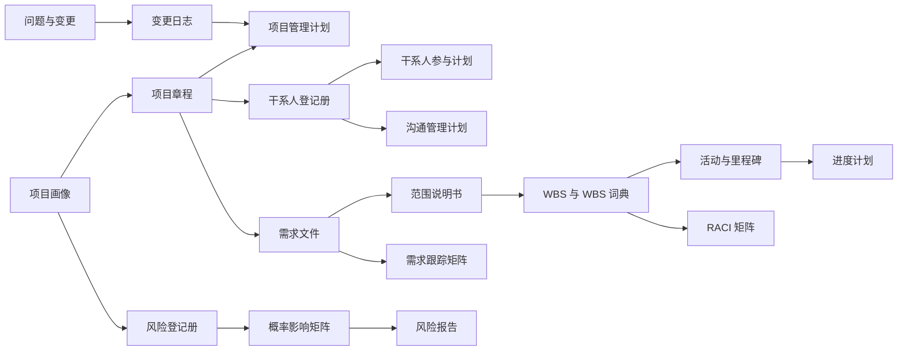

# Excel 模板盘点与产品化建议 v0.1

> 来源目录：`/Users/iman/Documents/Project/website/高项论文`  
> 处理方式：使用工作簿工具只读导入、结构检查并抽样渲染，未修改任何原文件  
> 日期：2026-07-18

## 1. 核心结论

这批 Excel 显著增强了产品的可落地性。Obsidian 资料负责解释“是什么、为什么、与什么有关”，Excel 资料能够补充“文档长什么样、有哪些字段、怎样填写”。

但这些文件目前是**带具体案例答案的静态文档样本**，还不是可以直接嵌入网站的产品模板。产品化时应拆为三层：

1. **模板定义**：字段、类型、校验、帮助、自动带入规则；
2. **案例示例**：BIM、水务、煤矿等现有示例内容；
3. **用户实例**：用户在自己项目中填写和生成的数据。

网站内部应保存结构化数据，Word 只是最终导出方式。否则模板之间无法自动传递信息，也无法根据推理树动态生成内容。

## 2. 文件清点

目录中有 11 个 `.xlsx` 文件，其中一个 `~$高项论文-质量管理.xlsx` 是 Excel 打开文件时生成的临时锁文件，已跳过。

实际资料：

- 10 个管理领域工作簿；
- 62 个工作表；
- 61 个唯一工作表名称；
- 2,230 个非空单元格；
- 0 个公式单元格；
- 1 个完全由图片组成的采购合同工作表。

“0 个公式”意味着成本合计、风险等级、采购评分、进度排布等结果全部是静态填写或人工着色，不能根据用户输入自动更新。

## 3. 模板覆盖清单

### 3.1 整合管理：8 张

- 整合管理；
- 项目章程；
- 假设日志；
- 项目管理计划；
- 问题日志；
- 经验教训登记册；
- 绩效报告；
- 变更日志。

评价：与 MVP 的导师式推演最相关，特别适合建立“项目画像 → 项目章程 → 管理计划 → 问题/变更/经验教训”的主干。

### 3.2 范围管理：7 张

- 范围管理计划；
- 需求管理计划；
- 需求文件；
- 需求跟踪矩阵；
- 范围说明书；
- 创建 WBS；
- WBS 词典。

评价：覆盖完整，能够建立从需求到交付物、设计、开发、测试的追踪链，是知识关系可视化的高价值样本。

### 3.3 进度管理：6 张

- 进度管理计划；
- 活动清单；
- 活动属性实例；
- 里程碑清单；
- 甘特图进度管理；
- 项目日历。

评价：字段基础完整，但甘特图当前用单元格填色表达时间，没有真实开始日期、结束日期、持续时间、依赖关系或公式。

### 3.4 成本管理：3 张

- 成本管理计划；
- 成本估算表；
- 预算表。

评价：适合作为 MVP 后扩展。当前数量和单位混在文本中，合计为静态值，需要改造成结构化数值、单位和公式模型。

### 3.5 质量管理：7 张

- 质量管理计划；
- 质量测量指标；
- 核对单；
- 质量报告；
- 测试与评估报告；
- 核查表；
- 质量控制测量结果。

评价：指标、目标值、实际值、偏差、改进措施和责任人的链条较完整，适合转成项目驾驶舱中的质量状态卡。

### 3.6 资源管理：8 张

- 资源管理计划；
- 项目章程；
- RACI 矩阵；
- 项目团队派工单；
- 资源分配单；
- 资源日历；
- 多标准决策；
- 团队绩效评估。

评价：RACI 和派工单可优先使用。该工作簿中的“项目章程”实际内容是团队价值观、沟通指南、决策规则和冲突处理，应规范命名为“团队章程”。

### 3.7 沟通管理：5 张

- 沟通管理计划；
- 沟通方法；
- 沟通记录表；
- 工作绩效报告；
- 干系人参与度评估矩阵。

评价：沟通计划可以与干系人登记册自动联动。当前“沟通原则和程序”是大段说明，不适合继续作为表格主体，应转成帮助说明或组织级规则。

### 3.8 风险管理：9 张

- 风险管理计划；
- 风险分解结构；
- SWOT 分析；
- 风险提示清单；
- 风险核查单；
- 风险登记册；
- 风险报告；
- 概率和影响矩阵；
- 定量定性分析。

评价：覆盖度很好，是第二个适合完成字段化的模板领域。概率、影响、优先级和策略需要统一定义，风险等级应由规则自动计算。

### 3.9 采购管理：6 张

- 采购管理计划；
- 采购策略；
- 采购工作说明；
- 供方选择分析；
- 评标标准；
- 采购合同。

评价：适合作为 MVP 后扩展。采购合同工作表只有两张图片，不是可读取、可编辑的合同字段模板；评标标准需要公式化权重、评分和汇总。

### 3.10 干系人管理：3 张

- 干系人登记册；
- 参与度评估矩阵；
- 干系人参与计划。

评价：三张表之间具备天然数据流，应共享同一批干系人 ID，而不是分别重复录入姓名和角色。

## 4. 与 Obsidian 知识库的映射

61 个唯一工作表名称中：

- 38 个与 Obsidian 笔记标题完全一致；
- 23 个没有完全同名，但多数存在可明确映射的别名或近义名称。

典型别名映射：

| Excel 名称 | Obsidian 名称 | 处理建议 |
|---|---|---|
| `RACI矩阵` | `RACI矩阵型` | 统一为 `RACI 矩阵`，保留别名 |
| `创建WBS` | `创建 WBS` | 消除空格差异 |
| `WBS词典` | `WBS分解` / 创建 WBS 相关内容 | 新增独立标准节点 |
| `范围说明书` | `项目范围说明书` | 统一到教材名称 |
| `采购工作说明` | `采购工作说明书` | 统一到教材名称 |
| `资源分配单` | `物质资源分配单` | 核对第 4 版标准名称 |
| `测试与评估报告` | `测试与评估文件` | 设置别名，校核语义 |
| `成本估算表` | `成本估算` | 区分过程与文档模板 |
| `团队绩效评估` | `团队绩效评价` | 统一标准名称 |
| `多标准决策` | `多标准决策分析` | 统一标准名称 |

产品中必须区分：

- “管理过程”节点，例如成本估算；
- “工具或技术”节点，例如多标准决策分析；
- “文档模板”节点，例如成本估算表。

名称相似并不代表它们是同一类对象。

## 5. 内容与数据质量问题

### 5.1 示例项目不一致

不同工作簿混用了多个案例：

- 整合、范围、进度、资源等大量内容使用 BIM 管理平台；
- 干系人登记册出现水务局项目；
- 采购评标标准使用煤矿传感器采购；
- 风险内容也出现煤矿和设备场景。

这些内容可以保留在案例库，但不能作为一套项目方案直接拼接导出。

### 5.2 名称或内容误标

- 资源管理工作簿中的“项目章程”实际是团队章程；
- 项目章程中的“项目推出标准”疑似应为“项目退出标准”；
- `绩效报告` 与 `工作绩效报告` 需要确认是否同义；
- WBS、测试文件、资源分配单等名称与 Obsidian 笔记存在差异。

### 5.3 存在疑似录入或识别错误

抽样发现：

- 采购服务时间出现“58 小时”“724 小时”，疑似缺少乘号；
- 变更日志存在重复序号；
- 项目章程不同位置出现 887.87 万元与 687.87 万元两种控制预算；
- 风险登记册中“风险类别”填入“很高”，类别、概率等级和优先级发生混用；
- 部分表格有错字、句子残缺或项目名称不一致。

### 5.4 数据类型不利于自动计算

例如成本估算表中：

- `1.6万元每人月` 是文本而不是数值与单位；
- `289人月` 是文本；
- 单项合计与总计是手工填写；
- 甘特图使用颜色而不是真实日期；
- 风险优先级不是由概率和影响计算；
- 采购评标标准没有供应商评分输入和公式汇总。

产品化时需要将“显示文本”与“可计算数据”分离。

## 6. 模板产品化分级

### A 级：可优先进入 MVP 字段建模

- 项目章程；
- 假设日志；
- 问题日志；
- 经验教训登记册；
- 变更日志；
- 需求文件；
- 需求跟踪矩阵；
- 项目范围说明书；
- WBS 与 WBS 词典；
- 活动清单与里程碑清单；
- 质量测量指标与核对单；
- 风险登记册与概率影响矩阵；
- 干系人登记册与参与计划；
- 沟通管理计划；
- RACI 矩阵。

这些模板的字段语义已经相对清晰，主要工作是统一名称、拆分示例、增加帮助与校验。

### B 级：需要计算或联动后再上线

- 甘特图；
- 成本估算与预算；
- 风险定性、定量分析；
- 多标准决策；
- 评标标准；
- 资源和项目日历；
- 质量控制测量结果；
- 干系人参与度评估矩阵。

这些模板的价值来自计算、条件格式或跨表联动，不能只复制现有单元格。

### C 级：作为参考资料，不直接变成模板

- 工具或方法的纯说明页；
- 只包含长段文字的计划说明；
- 图片形式的采购合同；
- 强绑定某个案例且字段不可复用的内容。

## 7. 建议的模板数据模型

### 7.1 模板定义

```json
{
  "id": "template.project-charter",
  "name": "项目章程",
  "domain": "integration",
  "output_of": "process.develop-project-charter",
  "knowledge_ref": "note.项目章程",
  "sections": [],
  "word_export": {
    "section_title": "项目章程",
    "layout": "key_value_table"
  },
  "review_status": "pending"
}
```

### 7.2 字段定义

```json
{
  "id": "charter.measurable_objectives",
  "label": "可测量的项目目标与成功标准",
  "type": "repeatable_objective",
  "required": true,
  "help": "分别描述指标、目标值、测量方法和确认人",
  "auto_fill_from": ["project.profile.objectives"],
  "validation": {
    "must_include_metric": true
  },
  "example_ref": "case.bim.charter.objectives"
}
```

### 7.3 用户实例

用户填写的数据单独保存：

```json
{
  "project_id": "car-app-001",
  "template_id": "template.project-charter",
  "version": 1,
  "status": "draft",
  "values": {},
  "source_decisions": [],
  "updated_at": ""
}
```

## 8. 模板之间的数据流



这条数据流应该成为网站中“文档为什么会出现、信息从哪里来”的核心可视化之一。

## 9. 网站中的模板体验

每个模板建议提供三个标签页：

1. **理解**：教材定义、产生过程、使用时机、上下游关系；
2. **填写**：结构化字段、自动带入、校验和导师提示；
3. **示例**：查看 BIM 案例或汽车 App 案例中的完成版本。

填写时应支持：

- 从项目画像、推理树和其他文档自动带入；
- 标记“用户确认、系统推断、待验证”；
- 显示每个字段为什么需要；
- 自动检查缺失、冲突和不可测量表达；
- 查看字段会影响哪些后续文档；
- 保存版本；
- 统一导出到 Word 方案包。

## 10. Word 导出建议

虽然 MVP 只导出 Word，内部仍必须保持结构化字段。Word 方案包可以组织为：

1. 项目画像与推演摘要；
2. 生命周期和管理方法；
3. 项目章程；
4. 项目管理计划摘要；
5. 范围、进度、质量、风险、干系人和变更管理章节；
6. 关键模板附件；
7. 待确认事项；
8. 教材知识映射附录。

表格过宽时应转换为横向页面或分表，不能简单把 Excel 截图贴入 Word。

## 11. 建议的下一步

1. 先把“项目章程”转换成第一份产品级字段定义；
2. 用汽车手机控制应用生成一份项目章程示例；
3. 验证从项目访谈和推理树自动带入字段的机制；
4. 再处理风险登记册，验证动态表格、风险评分和可视化；
5. 两个样本确认后，批量转换其他 A 级模板。

