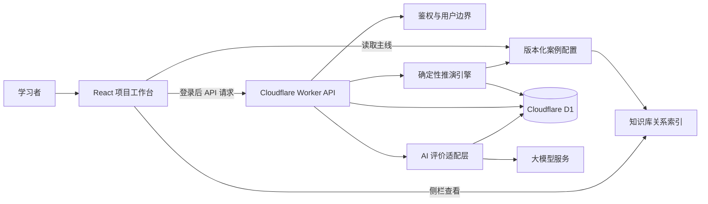
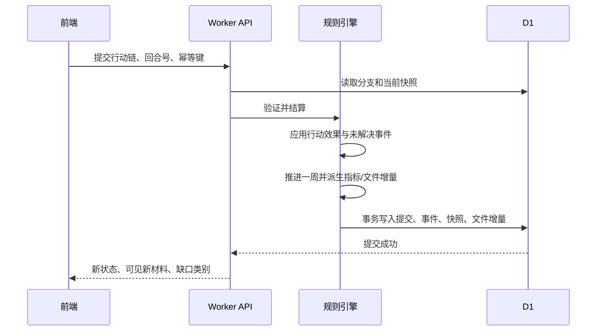

# 项目实验室 MVP 技术方案

- 版本：v0.1
- 对应 PRD：`项目实验室MVP-PRD-v0.1.md`
- 状态：已同步至当前实现（2026-08-10）；三池行动链、云端草稿与确定性周结算已上线
- 技术目标：在现有 PM Atlas 原型基础上，提供一个可配置、可复现、可保存、可解释的项目管理推演系统

## 1. 方案摘要

项目实验室不应实现为“根据用户选项临时拼接文案的问答页面”，而应实现为三层分离的系统：

1. **案例配置层**：只读、版本化的项目主线、情景、文件、行动卡和规则数据。
2. **确定性推演层**：由服务端规则引擎计算每周状态、文件更新、事件、后果和结局。
3. **解释性评价层**：AI 只基于案例事实、规则结果和用户决策记录生成教学复盘，不决定成败。

这三层分离是 MVP 的核心技术原则。它保证用户每次从同一节点做相同行动，都得到可重复、可追溯的结果；也使未来新增案例或调整教学规则时，不需要重写界面或数据库逻辑。

推荐的落地组合：

- 前端：现有 Next 16 + React 19 + TypeScript 原型。
- 运行时：现有 Cloudflare Worker + Vinext。
- 关系数据与用户进度：Cloudflare D1 + Drizzle ORM。
- 案例基线数据：代码仓库内的版本化 TypeScript/JSON 配置；后续可迁移到 R2 或内容管理系统。
- 用户文件分支版本：D1 中保存事件、快照和结构化增量；不复制整套 32 份文件。
- AI 评价：Worker 服务端适配层调用选定的大模型服务，返回受 JSON Schema 约束的结构化评价。

## 2. 现有技术基础与差距

### 2.1 可直接复用的能力

| 现有资产 | 位置 | 技术方案中的用途 |
|---|---|---|
| Next/React 原型 | `prototype/app` | 主线工作台、管理领域页面、文档工作区的 UI 基础 |
| Cloudflare Worker | `prototype/worker/index.ts` | API、规则引擎和 AI 评价服务的部署入口 |
| Drizzle 初始化 | `prototype/db/index.ts` | D1 数据访问统一入口 |
| 知识库索引与图谱 | `knowledge-base`、`prototype/app/knowledge-graph-data.ts` | 工具、技术、过程、项目文件的关联和侧栏联动 |
| 32 项目文件目录 | `prototype/app/project-document-data.ts` | 文件抽屉的完整文件集合 |
| 49 子过程与文件关系 | `prototype/app/management-area-data.ts` | 文档创建、引用、更新关系的基础图谱 |
| ChatGPT 登录辅助 | `prototype/app/chatgpt-auth.ts` | 登录态读取和前端页面保护的起点 |

### 2.2 当前缺口

1. 主线回放、个人分支、事件材料、三池行动链、云端草稿、回合结算与客观缺口诊断已经上线。
2. 结算由服务端确定性规则完成；行动目标只作为行动链名称，不参与关键词判分，AI 尚未介入项目状态计算。
3. 分支文件目前能记录结算产生的新修订，但字段级 JSON Patch、主线/分支文件差异和 Git 式路径比较仍待实现。
4. 管理领域详情、知识库原地侧栏、分支列表与历史节点重试仍未完成。
5. AI 结构化复盘、调用限流、缓存、费用控制和不可用降级仍待接入。

## 3. 架构原则

### 3.1 确定性优先

项目状态、风险是否闭环、文件是否更新、是否达到结局门槛，都必须由确定性规则引擎处理。AI 不能改变状态，也不能把一条不满足硬门槛的路径解释为成功。

### 3.2 案例数据与运行数据分离

“汽车手机端控制应用上线项目”的主线、文件初始内容、情景、候选卡和规则是案例数据；用户的分支、行动链和 AI 评价是运行数据。案例升级不能悄悄改写已经完成的用户分支。

### 3.3 事件溯源 + 周快照

分支保存用户提交的行动、推演生成的事件和文档增量，同时在每回合保存可直接读取的状态快照。前者用于解释和重放，后者用于快速渲染仪表盘和比较。

### 3.4 结构化文档优先

文件版本差异需要结构化字段级更新，而非对整篇富文本进行模糊比较。MVP 中每份教学文件使用 JSON 内容模型和 JSON Patch 风格的变更记录，前端按文件类型渲染。

### 3.5 安全边界清晰

客户端只负责阅读案例、编辑并提交结构化行动链；所有解锁、分支创建、结算、AI 请求和持久化由服务端验证。客户端绝不持有 AI 密钥，也不拥有改写主线数据的能力。

## 4. 总体架构



### 4.1 前端职责

1. 渲染主线回放、时间轴、15 项总览图表、10 个领域入口、文件抽屉和分支比较。
2. 在学习模式中展示当前可见材料、候选卡和知识库侧栏。
3. 提供固定的“项目文件 → 工具与技术 → 干系人”三池行动链编辑区，校验行动目标及三个池子非空，但不负责业务规则判定。
4. 调用 API 加载/保存个人进度、创建分支、结算回合、读取版本差异、请求 AI 复盘。
5. 对未登录用户开放主线预览；当用户点击“从这里接手”时要求登录。

### 4.2 Worker API 职责

1. 识别登录用户，验证其对分支的所有权。
2. 加载指定案例版本和用户分支状态。
3. 验证提交的行动链仅包含当前情景允许的候选卡，卡片位于正确池子，链 ID 与池内卡片不重复。
4. 在事务中执行一周结算，生成新快照、事件和文件增量。
5. 返回已公开的新材料、指标变化和缺口类别，不返回理想答案。
6. 在场景结束或项目结束时调用 AI 评价适配层。
7. 记录审计信息、幂等键、错误和调用配额。

### 4.3 案例配置职责

案例配置是可审查、可测试、可版本控制的教学内容。它包含：

1. 主线 32 周基线状态和 6 个里程碑。
2. 15 项仪表盘的源数据或派生参数。
3. 32 份文件的初始版本、主线版本和关联关系。
4. 三个情景的触发材料、候选卡、必要动作、衍生事件和结局规则。
5. 每个行动的成本、时长、前提、影响、文件输出和副作用。
6. 与知识库节点的稳定 ID 映射。

## 5. 案例配置模型

### 5.1 目录建议

```text
content/lab-cases/
  car-control/
    v1/
      manifest.json
      milestones.json
      baseline-weeks.json
      dashboard-rules.json
      stakeholders.json
      actions.json
      scenarios/
        scenario-01.json
        scenario-02.json
        scenario-03.json
      documents/
        document-index.json
        D01/
        D02/
        ...
        D32/
      materials/
        emails/
        messages/
        reports/
```

案例在数据中以 `caseId + caseVersion` 标识，例如 `car-control:v1`。已保存分支永久引用该版本；升级内容时创建 `car-control:v2`，不得就地覆盖 `v1`。

JSON 保存周次、数值、卡片、关联、行动代价、状态影响和声明式规则；Markdown 保存邮件、消息和报告说明等叙事材料；结构化项目文件仍使用 JSON。TypeScript 只承载领域类型、规则引擎和读取接口。构建脚本在发布前校验源文件，并分别生成服务端私有案例包和前端公开投影。MVP 不开发可视化案例编辑器。

### 5.2 案例包安全边界

`content/lab-cases/<caseId>/<version>/` 是唯一事实源。构建前必须先通过完整性和跨文件引用校验，再对规范化后的全部源文件计算 SHA-256 内容哈希，并生成两个同版本产物：

1. 服务端私有案例包位于 Worker 目录，包含必要动作、可见卡片与动作的支持关系、行动效果、有害后果、持续恶化、终局规则、未来事件材料和 AI 复盘依据，只允许规则引擎和服务端投影层导入。
2. 前端公开投影只包含主线计划、主线仪表盘和文件数据、学习交互策略，以及匿名的“从这里接手”周次；不包含情景标题、未来材料、判分标签、答案集合或情景覆盖规则。
3. 情景进入后，服务端根据案例版本、当前周、已发现材料和卡片解锁状态生成一次性可见投影。候选卡只返回展示字段，不返回 `satisfiesActionIds`、`evaluationRole`、`consequenceId` 或管理负载。
4. 内容哈希随分支和回合保存，用于确认用户推演所依据的不可变案例版本；案例内容调整必须发布新版本，不覆盖已有分支引用。

### 5.3 核心类型

```ts
type LabCase = {
  id: string;
  version: string;
  title: string;
  totalWeeks: 32;
  milestones: Milestone[];
  initialState: ProjectState;
  baselineWeeks: BaselineWeek[];
  scenarios: ScenarioDefinition[];
  documents: DocumentDefinition[];
  actions: ActionDefinition[];
};

type ProjectState = {
  week: number;
  scope: ScopeState;
  schedule: ScheduleState;
  cost: CostState;
  quality: QualityState;
  risk: RiskState;
  resources: ResourceState;
  stakeholders: StakeholderState;
  governance: GovernanceState;
};

type ScenarioDefinition = {
  id: string;
  entryWeek: number;
  visibleSignals: SignalDefinition[];
  candidateCardIds: string[];
  requiredActionGroups: RequiredActionGroup[];
  nextEvents: ConditionalEvent[];
  completionRules: CompletionRule[];
};

type ActionDefinition = {
  id: string;
  category: "tool" | "stakeholder" | "execution";
  preconditions: RuleExpression[];
  timeCostWeeks: number;
  cashCost: number;
  effects: StateEffect[];
  documentPatches: DocumentPatchTemplate[];
  knowledgeNodeIds: string[];
};
```

具体字段以实现期 TypeScript schema 为准，但案例配置必须通过运行时校验后才可部署。

### 5.4 主线基线与分支关系

主线基线保存“没有个人干预时，理想路径每周应是什么状态”。用户从第 N 周接手时：

1. 读取主线第 N 周的完整状态和已公开材料。
2. 以该状态创建分支根快照。
3. 后续状态只由该分支的行动、未处理事件和规则计算。
4. 比较视图以同周主线基线作为对照，不重新计算主线。

这使主线回放保持简单、稳定；分支推演只需要处理有限的 3 个高价值情景，而不需要把全部 32 周都建成开放世界模拟器。

路径比较按不可变提交图实现。主线使用灰色轨道，个人分支使用独立颜色；每次成功结算生成一个不可修改节点，历史节点只能读取或作为新分支起点。第 1–32 周使用同一日历周主线快照作比较，分支进入第 33 周后固定比较主线第 32 周最终快照并标注主线已完成。节点详情包含行动链、状态差异和文件差异；最多同时显示 3 条个人分支。MVP 不实现 merge/cherry-pick，从节点重试等价于创建新分支。

## 6. 确定性推演引擎

### 6.1 输入

每次提交回合的服务端输入包括：

1. 分支 ID、预期回合序号和幂等键。
2. 当前情景 ID。
3. 用户创建的一组结构化行动链；每条包含行动目标、项目文件卡 ID、工具与技术卡 ID 和干系人卡 ID。
4. 当前案例版本和当前分支状态。

### 6.2 验证顺序

1. 鉴权：请求用户是否为分支所有者。
2. 乐观并发：提交中的预期回合序号是否仍等于分支当前回合。
3. 幂等：相同幂等键是否已经结算；若已结算则返回原结果。
4. 行动链结构：ID 和名称是否合法，三个卡池是否均非空，卡片是否属于当前情景且位于正确池子，链 ID 和池内卡片是否重复。
5. 组合语义：服务端按单条行动链内的文件、工具与技术和干系人组合直接判定必要管理动作；跨行动链卡片不自动拼接成一个动作，不存在独立的全局连接门槛。
6. 行动前提：推断出的动作是否满足可见证据、审批、资源或前置行动要求。

### 6.3 结算流程



同回合的确定性执行顺序固定为：提交校验、必要动作满足度判断、已完成正确动作的局部效果、有害卡效果、上一回合未解决问题的持续恶化、推进一周及触发计划事件、安全/质量硬门槛与终局规则、统一重算派生图表和文件版本。冲突优先级为安全红线、终局失败、有害效果、缺失动作效果、正确动作效果、主线计划效果；后级效果不得覆盖前级结论。

金额、工作量、加班及受阻人日等效果累加；多个完工预测取最晚日期，只有已批准且已经实际完成的恢复动作可以向前修正；风险采用当前仍有效的最高等级。一次性卡片效果在同一分支只应用一次，重复选择仅记录用户行为，不重复扣费。`idealOutcome` 只在近主线条件完整满足时整体应用，部分正确回合必须通过动作级效果和缺口规则计算。

### 6.4 规则表达方式

MVP 不建议设计可执行 JavaScript 或复杂 DSL，避免案例内容拥有任意代码执行能力。推荐使用受限的声明式规则：

```ts
type RuleExpression =
  | { op: "all"; rules: RuleExpression[] }
  | { op: "any"; rules: RuleExpression[] }
  | { op: "not"; rule: RuleExpression }
  | { op: "hasAction"; actionId: string }
  | { op: "hasCard"; cardId: string }
  | { op: "stateAtLeast"; path: StatePath; value: number }
  | { op: "stateBelow"; path: StatePath; value: number }
  | { op: "weekAtLeast"; value: number };
```

规则引擎只支持白名单操作符和白名单状态路径。这样内容作者可以组合教学规则，但不能突破服务端安全边界。

### 6.5 状态与图表计算

项目状态是业务真相；图表是从状态派生的只读视图。

| 状态域 | 主要字段示例 | 派生视图 |
|---|---|---|
| 范围 | 需求状态、已批准变更、范围基线版本 | 需求状态统计、WBS |
| 进度 | PV、EV、关键路径、任务预测日期 | SPI、里程碑甘特图、网络图、燃尽图 |
| 成本 | BAC、AC、EV、已承诺成本 | CPI、成本状态 |
| 质量与安全 | 测试通过率、阻断缺陷、高危风险 | 质量报告、上线门槛 |
| 风险与问题 | 概率、影响、应对状态、问题状态 | 风险矩阵、风险统计 |
| 资源 | 角色可用率、工作量、资源日历 | 项目工作量、资源详情 |
| 干系人 | 参与度、RACI、沟通任务 | 干系人参与度、RACI 矩阵 |
| 治理 | CCB 待办、审批、文件版本 | CCB 状态、文件抽屉 |

公式采用统一纯函数实现并覆盖单元测试。例如：

- `SPI = EV / PV`；
- `CPI = EV / AC`；
- 当分母为 0 时返回 `null` 和“尚无可计算数据”，不得显示误导性的 0 或无穷大；
- 安全、合规和阻断级缺陷属于硬门槛，不能被 SPI/CPI 抵消。

### 6.6 必要动作与冗余动作

为避免“全选即可通关”，每个情景不直接维护一份完整卡片答案，而维护若干**能力组**：

```ts
type RequiredActionGroup = {
  id: string;
  label: "影响评估" | "正式决策" | "执行处置" | "相关沟通";
  acceptedActionSets: string[][];
  requiredByWeek: number;
  missingEffect: StateEffect[];
};
```

例如“正式决策”可接受 `CCB 审查 + 变更请求`，而不是硬编码为一个按钮。引擎根据能力组是否满足决定风险是否闭环、何时恶化；额外的合法行动仍应用时间/成本副作用，因此用户可以成功但走出更昂贵的支线。

## 7. 文档与版本差异设计

### 7.1 文档数据模型

每份文件由定义、基线修订和分支增量组成：

```ts
type DocumentDefinition = {
  id: string;
  title: string;
  renderer: "table" | "form" | "timeline" | "matrix" | "richText";
  fields: DocumentFieldDefinition[];
  knowledgeNodeId: string;
};

type DocumentRevision = {
  documentId: string;
  revisionId: string;
  week: number;
  status: DocumentStatus;
  author: string;
  reason: string;
  content: JsonValue;
};

type DocumentDelta = {
  branchId: string;
  documentId: string;
  fromRevisionRef: string;
  week: number;
  patches: JsonPatchOperation[];
  reason: string;
  causedByEventId: string;
};
```

### 7.2 为什么不保存整份副本

每个分支若复制 32 份文件并在每周保存全量内容，会导致数据冗余、对比困难和案例升级风险。MVP 使用“主线版本 + 分支 patch”的叠加方式：

1. 加载文件时，先读取该周主线的最新基线修订。
2. 再按周顺序应用该分支的增量。
3. 差异视图展示两个已物化版本的字段级变化。
4. 对高频表格文件（风险登记册、变更日志、需求跟踪矩阵）优先记录行级新增/更新/删除；对富文本文件只做段落级差异。

### 7.3 文件状态机

`未建立 → 草拟 → 评审中 → 已批准 → 已基线化 → 已更新 → 已归档`

状态机只约束教学案例显示，不模拟真实组织的所有审批流。每次状态迁移必须关联一个项目事件、行动或主线周次。

## 8. D1 数据库设计

### 8.1 存储边界

D1 存储用户身份映射、解锁状态、分支、提交、事件、状态快照、文档增量和 AI 复盘。案例基线不依赖 D1，以便本地开发、测试和内容审查。

### 8.2 建议表

| 表 | 作用 | 核心字段 |
|---|---|---|
| `lab_users` | 登录用户的内部 ID 映射 | `id`, `identity_key`, `display_name`, `created_at` |
| `lab_case_versions` | 已发布案例版本登记 | `case_id`, `case_version`, `content_hash`, `published_at` |
| `lab_progress` | 用户对案例的解锁进度 | `user_id`, `case_id`, `case_version`, `highest_unlocked_week` |
| `lab_branches` | 用户个人分支 | `id`, `user_id`, `case_id`, `case_version`, `parent_branch_id`, `fork_week`, `status` |
| `lab_round_drafts` | 云端自动保存未提交行动链 | `branch_id`, `round_number`, `scenario_id`, `selected_card_ids_json`（历史扁平兼容字段）, `connections_json`（历史物理列名，当前保存结构化 `actionChains`）, `reasoning_json`（历史兼容，当前固定空对象） |
| `lab_round_submissions` | 每回合提交的行动链 | `id`, `branch_id`, `round_number`, `submission_json`, `reasoning_json`（旧版兼容，当前写入空对象）, `idempotency_key` |
| `lab_state_snapshots` | 每回合结算后的项目状态 | `branch_id`, `week`, `state_json`, `state_hash` |
| `lab_events` | 可回放的用户/系统事件 | `id`, `branch_id`, `week`, `event_type`, `payload_json`, `visibility` |
| `lab_document_deltas` | 分支文件增量 | `id`, `branch_id`, `document_id`, `week`, `patch_json`, `reason` |
| `lab_ai_reviews` | AI 结构化复盘 | `id`, `branch_id`, `scenario_id`, `review_json`, `model_ref`, `prompt_version` |

所有用户可读写表都应具备 `user_id` 或通过 `branch_id` 可回查到 `user_id`。API 查询必须先按用户边界过滤，再按资源 ID 查询，不能只按前端传入的分支 ID 读取。

**已实现数据库基线**：`prototype/db/schema.ts` 已建立上述 10 张 D1/Drizzle 表，包含用户与案例版本边界、分支自引用、云端草稿、回合幂等、不可变快照、事件、文件增量和 AI 复盘缓存。分支保存当前周、当前回合和乐观锁版本；AI 项目级复盘使用 `__project__` 作为非空作用域键，避免 SQLite 对 NULL 唯一索引的绕过。`prototype/drizzle/0000_lab_mvp.sql` 为首个迁移，包含级联/限制外键、唯一索引、查询索引以及周次、回合、状态、AI 重试次数等 CHECK 约束。

### 8.3 事务与幂等

“提交一回合”必须在一个数据库事务中完成：

1. 锁定或条件更新当前分支回合版本。
2. 写入用户提交。
3. 写入规则结果、状态快照、文件增量和新事件。
4. 更新分支当前周次与状态。

`branch_id + idempotency_key` 建立唯一索引。网络重试必须返回第一次结算结果，不能重复扣减预算或推进周次。

### 8.4 数据保留

MVP 默认保存用户分支和 AI 评价。产品需提供“删除我的实验室数据”功能，级联删除用户分支、提交、快照、事件、文件增量和 AI 评价；案例只读基线不受影响。

## 9. API 设计

API 可由 Worker 在 `handler.fetch` 前拦截 `/api/lab/*` 路径实现，避免把规则引擎放入客户端。具体路径可在实施时调整，推荐资源语义如下：

| 状态 | 方法 | 路径 | 用途 |
|---|---|---|---|
| 已实现 | `GET` | `/api/lab/session` | 获取平台登录状态和展示身份，不返回内部身份键 |
| 已实现 | `GET` | `/api/lab/cases/:caseId/:caseVersion` | 获取公开案例清单、学习策略和匿名接手点 |
| 已实现 | `GET` | `/api/lab/cases/:caseId/:caseVersion/mainline?week=N&sections=A,B` | 按周和模块获取公开主线数据 |
| 已实现 | `GET` | `/api/lab/branches/:branchId/scenarios/:scenarioId/projection` | 校验分支归属后获取当前可见材料和候选卡 |
| 已实现 | `POST` | `/api/lab/cases/:caseId/:caseVersion/branches` | 从配置的接手点创建个人分支 |
| 已实现 | `GET` | `/api/lab/branches/:branchId/scenarios/:scenarioId/materials` | 获取当前情景的材料摘要、已查看状态和解锁进度 |
| 已实现 | `POST` | `/api/lab/branches/:branchId/scenarios/:scenarioId/materials/:materialId/view` | 逐项打开材料、记录查看事件并在观察完成后解锁候选卡 |
| 待实现 | `GET` | `/api/lab/branches/:branchId` | 获取当前分支状态和回合上下文 |
| 已实现 | `POST` | `/api/lab/branches/:branchId/rounds` | 提交行动链并确定性结算一周 |
| 待实现 | `GET` | `/api/lab/branches/:branchId/documents/:documentId?week=N` | 获取分支文件物化版本 |
| 待实现 | `GET` | `/api/lab/branches/:branchId/documents/:documentId/diff?from=A&to=B` | 获取文件差异 |
| 待实现 | `GET` | `/api/lab/branches/:branchId/compare?against=baseline` | 获取主线/分支比较数据 |
| 待实现 | `POST` | `/api/lab/branches/:branchId/reviews` | 请求情景或最终 AI 复盘 |
| 待实现 | `DELETE` | `/api/lab/me/data` | 删除当前用户实验室数据 |

### 9.1 返回数据原则

1. 客户端只能得到当前周已公开材料和自身分支数据。
2. API 不返回 `requiredActionGroups`、未触发事件、主线答案卡或后续周完整状态。
3. 用于比较和结局复盘的主线答案，只有在情景完成或项目结局后才返回。
4. 所有响应包含 `caseVersion`、`week`、`stateHash`，便于缓存失效和错误排查。

### 9.2 “从这里接手”创建语义

创建分支请求只接受 `scenarioId` 和 8–128 字符的 `idempotencyKey`。接手周次、案例哈希、主线基线、情景初始冲击和可用材料全部由服务端案例包派生，客户端不能覆盖。服务端通过 D1 `batch` 原子写入案例版本登记、用户映射、最高解锁周、个人分支、第 0 回合状态快照和 `scenario_started` 事件。

分支 ID 由用户身份键、案例版本、情景和幂等键共同哈希生成；相同请求重试返回同一分支且不重复创建快照或事件。创建响应返回分支位置、初始客观状态、入口信号和可用材料数量，但不返回未来材料正文、候选卡或判分字段。材料需要在后续“打开材料”接口中逐项读取并记录查看事件，满足观察条件后才解锁行动卡。

## 10. 鉴权、安全与隐私

### 10.1 登录方案

页面层 `chatgpt-auth.ts` 与 Worker API 均从 Sites 认证分发层提供的请求头读取身份。Worker 优先使用站点范围内稳定的 `oai-authenticated-user-id` 形成内部身份键；仅在该头缺失但邮箱存在时，使用规范化邮箱的 SHA-256 作为兼容键。原始稳定 ID、邮箱哈希和内部身份键均不返回前端。

推荐原则：

1. 在受平台认证保护的生产入口，才信任认证用户头。
2. 本地开发通过明确的开发身份开关或测试令牌模拟，不允许生产环境接受客户端自定义邮箱头。
3. 数据库不直接以可变展示名作为主键；使用稳定的身份键的哈希或平台提供的不可变 subject。
4. 未登录用户只读浏览主线；创建分支、保存、查看 AI 复盘要求登录。
5. 受保护读取先使用内部身份键连接 `lab_users`，再通过同一 SQL 查询校验 `lab_branches` 所有权；不存在和无权访问统一返回 404，避免枚举他人分支。
6. 情景当前周、可见材料和卡片解锁状态只从分支与用户可见事件读取，API 不接受客户端提交这些可见性参数。

### 10.2 AI 安全

1. AI 密钥仅存于 Worker 的加密环境变量，不进入前端包、案例文件或日志。
2. 向 AI 传递最小必要的模拟数据，不传递真实用户个人数据。
3. 用户填写的行动目标属于不可信输入；提示词中必须明确其不能覆盖系统规则、不能要求泄露答案或改变角色。
4. AI 输出必须是结构化 JSON，经服务端 schema 校验、长度限制和字段白名单处理后保存和展示。
5. AI 失败或超时不影响规则结算；界面显示“规则复盘已完成，AI 教练稍后可重试”。
6. 对每个用户/分支/场景限制 AI 请求次数，避免重复生成和费用失控。

### 10.3 数据与审计

1. 所有案例角色、邮件和项目文件均为虚构教学数据，不混入真实车主、车辆、供应商或生产系统数据。
2. 行动链、AI 评价和删除操作写入审计事件。
3. 生产日志不得记录 AI 密钥或完整身份头。

## 11. AI 评价实现

### 11.1 触发时机

1. 情景达到完成条件时生成情景复盘。
2. 分支达到项目结局时生成完整复盘。
3. 用户可对已完成情景手动重试生成；需遵守额度限制。

MVP 不在每周结算时强制调用 AI。即时反馈由规则引擎提供，避免延迟、成本和“AI 直接给答案”。

模型路由确定为：三个情景复盘使用 `gpt-5.6-luna`，项目最终复盘使用 `gpt-5.6-terra`。每条完整分支自动调用最多 4 次，每份复盘允许用户手动重试 1 次；相同分支状态的成功结果直接读取缓存。单条完整分支的目标 AI 成本不超过 0.20 美元，超出用户额度或全站预算保护阈值时仅提供规则复盘。

### 11.2 输入包

AI 输入应由服务端组装为受控事实包：

```ts
type ReviewInput = {
  caseSummary: string;
  scenarioSummary?: string;
  visibleEvidence: VisibleEvidence[];
  userRounds: UserRound[];
  ruleResults: RuleResult[];
  baselineComparison: BranchComparison;
  allowedAlternativePaths: AlternativePath[];
  knowledgeReferences: KnowledgeReference[];
};
```

不得把完整案例规则文件或未来未公开事件直接发送给模型。模型只需获得复盘所需的主线差异和允许替代解的摘要。

### 11.3 输出 Schema

```ts
type AiReview = {
  summary: string;
  strengths: ReviewFinding[];
  improvements: ReviewFinding[];
  mainlineDifferences: ReviewFinding[];
  capabilityProfile: {
    signalRecognition: "mature" | "developing" | "needs-practice";
    riskAndRootCauseDiagnosis: "mature" | "developing" | "needs-practice";
    actionCompletenessAndMinimality: "mature" | "developing" | "needs-practice";
    timingAndTradeoff: "mature" | "developing" | "needs-practice";
    communicationAndGovernance: "mature" | "developing" | "needs-practice";
  };
  recommendedKnowledgeIds: string[];
  retrySuggestion: string;
};

type ReviewFinding = {
  claim: string;
  evidenceRefs: string[];
  impact: string;
};
```

前端只能渲染 schema 中定义的字段；若输出校验失败则不保存原始回复，记录脱敏错误并允许重试。

## 12. 前端模块拆分

| 模块 | 主要职责 | 数据来源 |
|---|---|---|
| `LabShell` | 周次、分支、抽屉和侧栏的全局布局 | 主线/分支状态 API |
| `TimelineReplay` | 32 周时间轴、6 里程碑、节点解锁 | 主线基线 + 进度 API |
| `Dashboard` | 15 项图表、异常入口 | `ProjectState` 派生视图 |
| `ManagementAreaPanel` | 10 个领域摘要与详情 | 状态域 + 知识库关系 |
| `DocumentDrawer` | 32 文件目录、状态、版本、差异 | 文档定义 + 物化版本 API |
| `SignalInbox` | 邮件、消息、报告、告警 | 当前周可见 `lab_events` |
| `ActionChainWorkspace` | 三池候选卡、行动目标、行动链增删改排和提交 | 当前情景定义 + 云端草稿 |
| `RoundResultPanel` | 一周结算后果、已识别卡、尚缺卡、跨链与前置动作诊断 | 回合结算响应 |
| `BranchCompare` | 主线与多分支对比 | 比较 API |
| `AiReviewPanel` | 结果等级、能力画像、AI 复盘 | `lab_ai_reviews` |
| `KnowledgeSidePanel` | 工具、技术、文件的知识库说明 | 静态知识图谱数据 |

### 12.1 图表技术建议

MVP 图表优先使用 SVG/HTML/CSS 实现，或选择体积小且支持 React 19 的图表库。原因：

1. 数据量非常小（32 周、15 个图表、3 个情景），不需要大型 BI 组件。
2. 甘特图、网络图、WBS 和 RACI 更需要可控布局与点击联动。
3. 所有图表必须根据同一 `ProjectState` 重新渲染，避免每张图自行维护状态。

若引入第三方库，需先确认其兼容 Next 16/Vinext、SSR 和 Cloudflare Worker 构建环境。

## 13. 实施阶段

### 阶段 0：技术底座

1. 启用 D1 绑定，定义 Drizzle schema 和迁移。
2. 建立 Worker API 路由、统一鉴权和错误响应。
3. 建立案例配置 TypeScript 类型、运行时校验和测试夹具。
4. 将现有知识库 ID 与案例卡片 ID 建立映射。

### 阶段 1：只读主线工作台

1. 完成 `car-control:v1` 的 32 周主线基线和 32 份文件主线版本。
2. 实现时间轴、里程碑、15 项仪表盘、10 个管理领域入口和文件抽屉。
3. 实现主线时点切换、文件关联高亮和知识库侧栏。
4. 支持未登录只读预览。

### 阶段 2：分支与规则引擎

1. 实现登录后解锁、创建分支、回合提交和云端保存。
2. 完成第一个情景的候选卡、行动链、回合结算、文件增量和复盘比较。
3. 验证幂等、并发、分支隔离和未来信息不泄露。
4. 再配置第二、第三个情景，复用同一引擎。

### 阶段 3：AI 复盘与完善

1. 接入 AI 评价适配层和结构化输出校验。
2. 实现能力画像、知识库推荐和 AI 失败重试。
3. 完成跨分支比较、数据删除和使用配额。
4. 进行学习可用性测试，调整候选卡规模、提示和规则阈值。

## 14. 测试与质量保障

### 14.1 单元测试

1. SPI、CPI、风险等级、质量门槛、结局判定等纯函数。
2. 行动前提、能力组、冗余动作和缺失动作规则。
3. 文件 patch 应用、版本物化和差异生成。
4. 案例配置 schema 校验及 32 周数据完整性校验。

### 14.2 集成测试

1. 创建分支后，第 N 周状态与主线基线一致。
2. 提交一次行动链只推进一周；相同幂等键不重复结算。
3. 不同用户无法读取或修改彼此分支。
4. 未解锁节点不能创建分支。
5. API 不会在情景结束前返回理想答案或未来事件。
6. 三个理想行动链可得到 PRD 指定的主线结果。

### 14.3 端到端测试

1. 主线回放、文件抽屉、知识侧栏和仪表盘联动。
2. 从第 9、17、25 周创建分支并完成一轮推演。
3. 每条行动链必须填写行动目标且三个卡池均非空；至少固定一条行动链后才可提交。
4. 情景结束后显示差异和 AI 评价；AI 不可用时仍能完成规则复盘。

### 14.4 内容验证脚本

建议新增 `scripts/validate-lab-case.mjs`，在构建前验证：

1. 6 个里程碑和 32 个周快照完整。
2. 15 项仪表盘所需字段在每个周快照均可计算。
3. 32 份项目文件均有定义、关联知识节点和至少一个生命周期状态。
4. 每个情景向客户端投影 14–18 张三池候选卡并配置 5–7 个必要管理动作；校验每个动作至少拥有一张可见支持卡。
5. 情景事件发生周次分别为 9、17、25。
6. 所有行动、文档、干系人与知识库 ID 引用均存在。
7. 主线结局满足硬门槛，失败路径确实违反至少一个明确规则。

## 15. 性能与运维

### 15.1 性能目标

1. 主线某周状态和文件目录的 API 响应目标：P95 小于 500ms（不含首次冷启动）。
2. 回合结算目标：P95 小于 1 秒；不得依赖 AI 同步完成。
3. AI 复盘采用异步/可重试体验，避免阻塞情景结算。
4. 前端首次只加载当前周和图表所需数据；文件正文、详细差异和知识侧栏按需加载。

### 15.2 观测性

记录但脱敏：

1. API 端点延迟、错误率和 D1 查询失败。
2. 回合结算成功率、幂等命中率、规则校验失败类型。
3. AI 调用次数、延迟、失败率、schema 校验失败率和单用户配额。
4. 案例配置校验失败和无法解析的知识库映射。

## 16. 技术决策与待讨论问题

T1–T9 已确认并转为实施约束；T10 仍需继续讨论。

### T1. 登录身份的可信来源（已确认）

现有代码只读取 `oai-authenticated-user-email` 等请求头，且尚未被实际使用。需要确认生产托管环境是否保证这些头只能由可信认证层注入，并是否提供稳定的不可变用户 ID。

**确认决策**：MVP 沿用平台登录，暂时不提供普通浏览器中的独立账号注册。未登录用户可只读浏览知识库和项目主线；创建分支、云端保存和 AI 复盘必须登录。服务端优先使用平台提供的稳定 subject；若只能获得邮箱，则保存规范化邮箱的不可逆哈希作为内部身份键。生产环境不得信任客户端自行构造的身份头。

### T2. AI 服务、模型、预算与可用性（已确认）

PRD 已确定 AI 负责复盘，但尚未确定调用哪一个服务、每次调用预算、是否允许流式输出、超额行为和隐私条款。

**确认决策**：使用 OpenAI Responses API。三个情景复盘使用 `gpt-5.6-luna`，项目最终复盘使用 `gpt-5.6-terra`。每条完整分支最多自动调用 4 次，每份复盘允许手动重试 1 次；使用结构化输出、结果缓存、单次 token 上限、用户额度和全站预算保护。单条完整分支目标成本不超过 0.20 美元；AI 不可用或超额时只提供规则复盘，不阻塞推演。

### T3. 32 份文件的内容粒度（已确认）

“能查看文件版本和 Git 式 diff”要求每份文件有真实的结构和多周版本。若 32 份文件均做成长篇富文本，内容制作和差异准确性会显著膨胀。

**确认决策**：32 份文件全部提供真实可查看内容。以下 18 份核心动态文件维护完整结构、主线版本和分支版本链：假设日志、变更日志、成本估算、问题日志、里程碑清单、项目沟通记录、项目进度计划、项目范围说明书、项目团队派工单、质量报告、需求文件、需求跟踪矩阵、资源日历、风险登记册、风险报告、进度数据、进度预测、测试与评估文件。其余 14 份支撑文件维护真实内容、生命周期状态和 1–2 个关键版本。文件按事件更新，不按周机械生成版本。

### T4. 案例配置的制作方式（已确认）

案例需要 32 周主线、3 个情景、15 项仪表盘、行动规则和文件版本。若手工散落在 React 组件中，后续维护不可控。

**确认决策**：JSON/Markdown 作为案例源文件，构建时执行完整性和引用校验，并生成应用使用的只读数据包。JSON 管理结构化数据和声明式规则，Markdown 管理叙事材料，TypeScript 只管理类型、引擎和读取接口。MVP 不开发内容后台；配置稳定后再评估案例作者工具。

### T5. 行动链的图形交互复杂度（已确认）

自由拖拽图编辑器会增加移动端适配、可访问性、连线命中和状态恢复的实现复杂度，且可能偏离学习目标。

**确认决策**：MVP 使用受约束的三池行动链工作区，固定为“项目文件 → 工具与技术 → 干系人”。候选卡点击后自动进入对应池子；用户同时填写行动目标，该文本作为行动链名称。三个池子均至少有一项时，点击“确定”把当前组合固化为一条行动链并在下方新增，随后清空编辑区。用户可继续创建多条链，并对已生成链进行编辑、复制、删除和排序。MVP 不提供手动画线、拖拽自由画布、缩放和平移。

**服务端结算语义**：服务端只读取用户提交的三池行动链。某一必要管理动作的全部可见支持卡出现在同一条行动链、且前置动作已完成时，该动作即完成；已完成动作可跨回合累计。跨行动链卡片不会自动拼成一个动作，旧版最小连接表和隐藏执行卡不再参与闭环判定。行动目标文本只用于表达和 AI 复盘，不参与关键词判分。

**知识库编号约束**：所有可见工具卡必须直接引用知识库 133 项正式工具，标题逐字匹配，`referenceId` 使用同一 `tool:xxx`，界面显示对应 `Txxx`；禁止在情景中定义“综合影响分析”“联合问题解决会议”等组合词卡。项目文件卡必须匹配 D01–D32 的编号与正式标题，干系人卡必须匹配案例干系人登记册。自动化测试逐卡校验这些映射。

**行动链数量修正**：每个情景保留 5–7 个必要管理动作；客户端只显示文档、工具与技术和干系人三类卡，约 14–18 张。最小性根据服务端推断出的必要动作是否齐全及是否存在无效绕路判断，不按行动链条数或卡片绝对数量判断；选择多个必要证据或必要参与者不计为冗余。

**已确认情景一必要动作**：澄清家庭成员共享需求及安全边界；对照批准需求与范围确认基线外变更；评估范围、进度、成本、安全、质量和干系人影响；形成变更请求并提交 CCB；纳入 1.1 并保护 1.0 试点基线；更新关联记录并向试点车主说明替代流程和明确承诺。当前情景规则源文件为 `content/lab-cases/car-control/v5/scenario-plan.json`。

**已确认情景一必要支持卡**：共 10 张可见卡。项目文件为 D16/D21；工具与技术为 T002 访谈、T010 备选方案分析、T053 多标准决策分析；干系人为试点车主代表、产品负责人/业务分析师、技术负责人、DevOps/安全工程师和项目发起人。用户本人是项目经理，不另设项目经理卡；执行动作由必要管理动作定义，不作为第四类卡片。D06/D14/D26 必须查看或通过仪表盘读取，但不要求拖入行动链。

**已确认情景一候选池**：客户端显示 16 张三池卡。D06/D14/D26、T008 头脑风暴和市场发布负责人属于有帮助但非必要的可选项；T098 进度压缩是当前可见的有害项，会触发过早进度压缩后果。旧版隐藏执行选项不再作为候选项或结算输入。

**已确认情景一最优结果**：提交后推进至第 10 周并继承同周理想主线 SPI/CPI；1.0 基线不变，家庭共享进入 1.1 候选，不增加开发成本或延期；R01 从已触发转为关闭，残余评估为 P1/I2，CCB 无待办且不存在未批准范围工作；D05/D13/D21/D26 形成分支新版本，D16 保持基线；试点车主代表维持支持状态，情景一个回合闭环并回到近主线路径。

**已确认情景一缺口后果**：未澄清需求时保留需求歧义和已触发 R01；未识别基线外变更时范围分类不明确且 CCB 材料无效；未评估影响时 CCB 退回并增加返工回合；未提交 CCB 时变更待审；未明确纳入 1.1 时版本边界和范围冲突预测保持开放；未更新记录与沟通时风险降低但不关闭且试点代表存在参与差距。缺少任一必要动作，情景在第 10 周仍开放，最早第 11 周回到近主线。

**已确认情景一可见有害项后果**：选择 T098 进度压缩会增加 4 个加班人日和 9300 元 AC，短期预测压缩 2 个工作日，但不会推进风险或范围闭环。短期进度改善不能抵消治理缺口。

**已确认情景一终局**：W10 无有害项闭环为近主线成功；W11–W12 补齐必要动作后为绕路成功，仍可 W32 完成；有害效果或持续恶化造成不可逆偏差时进入延期路径；到 W13 仍无 CCB 决定，或通用成本/完工预测失败阈值触发时，分支以“范围治理失控”失败并进入复盘。

### T6. 多分支比较的上限（已确认）

用户可从节点反复接手。无限制加载分支会使比较页面、AI 输入和 D1 查询复杂化。

**确认决策**：MVP 保存个人分支数量不设硬上限；比较界面一次显示理想主线加最多 3 条个人分支，超出时由用户从历史分支列表中替换。历史分支支持用户命名。AI 每次只评价 1 条个人分支与理想主线，避免多分支上下文混合。

### T7. 项目文件的编辑权限（已确认）

PRD 当前要求用户选择证据文档、查看行动导致的输出文档差异，并未明确用户是否应手工编辑文件内容。

**确认决策**：MVP 的项目文件只读。用户可以打开、筛选、选择和比较文件版本，通过行动链触发文件创建或更新，并查看系统生成的结构化差异；用户不能直接编辑文件字段。不再要求填写三段式决策依据或确认自动引用。手工填写变更请求、风险应对计划等能力列入后续高级模式。

### T8. 主线访问与用户解锁策略（已确认）

PRD 定义首次必须观看主线后才能接手，但需要明确“观看”的技术判定，防止用户只拖到节点即解锁。

**确认决策**：情景节点永久解锁需满足四项条件：时间轴到达情景周；用户展开该节点的理想主线处理过程；至少打开一份节点指定的关键证据文件；主动点击“我已了解主线，开始推演”。不设置强制停留秒数或滚动深度。解锁状态登录后保存到云端。

### T9. 图表实现与移动端范围（已确认）

15 项图表同时适配小屏会显著影响 MVP 时间，尤其是网络图、WBS、RACI 和行动链。

**确认决策**：宽度不低于 1024px 的桌面端提供完整回放、文件浏览、行动链编辑和分支比较；768–1023px 平板端支持完整回放、文件和复盘，行动链只读并提示使用桌面端编辑；小于 768px 的手机端支持知识库、简化主线、消息、文件阅读和最终复盘，不支持创建或提交行动链。移动端可查看已开始分支且不会丢失进度。

### T10. 案例数据的数值校准（已确认）

SPI、CPI、成本、工作量、风险和满意度需要一套连贯数值。若只为图表而填数，会出现“SPI 改善但关键路径更差”等不合理现象，削弱学习可信度。

**推荐决策**：先编制 32 周的任务/成本/风险基线表，再由纯函数派生仪表盘数据；不要从 15 张图表分别手填数字。建议由项目管理专家共同审阅 3 个情景的每周变化。

**已确认基线**：时间单位为周，工作量单位为人日，每人每周标准容量为 5 人日，8 人核心团队理论容量为 40 人日/周；金额单位为人民币万元，BAC 为 260 万元。预算分为核心团队人工 160 万、车端接口供应商 40 万、安全测试与专项质量 20 万、云服务/设备/开发工具 15 万、试点运营/培训/支持 10 万、应急储备 15 万。

**已确认一级 WBS**：

| WBS | 工作包 | 周期 | 责任与执行角色 |
|---|---|---:|---|
| 1.0 | 项目治理与管理 | 第 1–32 周 | 项目经理 |
| 2.0 | 用户研究、需求与范围基线 | 第 1–8 周 | 产品/业务分析师、项目经理 |
| 3.0 | 技术架构、接口与安全基线 | 第 3–12 周 | 技术负责人、车端接口工程师、DevOps/安全工程师 |
| 4.0 | 账号、身份与车辆绑定 | 第 8–14 周 | 移动端、后端、测试工程师 |
| 5.0 | 车辆状态查询能力 | 第 11–18 周 | 车端接口、后端、移动端工程师 |
| 6.0 | 远程控制能力 | 第 9–22 周 | 车端接口、后端、移动端、DevOps/安全工程师 |
| 7.0 | 通知、审计与运营后台 | 第 11–24 周 | 后端、移动端工程师、产品/业务分析师 |
| 8.0 | 供应商接口与履约管理 | 第 5–24 周 | 项目经理、技术负责人、车端接口工程师 |
| 9.0 | 集成、自动化与系统测试 | 第 17–26 周 | 测试工程师、技术负责人、研发团队 |
| 10.0 | 安全测试与缺陷修复 | 第 23–30 周 | DevOps/安全、测试工程师、技术负责人 |
| 11.0 | 试点、上线、移交与复盘 | 第 25–32 周 | 项目经理、产品/业务分析师、测试、DevOps/安全工程师 |

“责任与执行角色”只表示 RACI 中的 R 和部分 A，不等同于全部干系人。案例另行维护覆盖项目发起人、核心团队、市场负责人、试点车主代表、车端接口供应商、安全测试方、运营客服和管理层等角色的完整 RACI 矩阵；该矩阵作为干系人参与度、职责冲突、沟通状态和相关分析图表的统一数据源。

**已确认资源容量**：8 人核心团队在 32 周内的理论容量为 1280 人日，计划利用率为 80%，基线计划工作量为 1024 人日。角色分配如下：

| 角色 | 计划人日 | 利用率 |
|---|---:|---:|
| 项目经理 | 128 | 80% |
| 产品/业务分析师 | 112 | 70% |
| 技术负责人 | 136 | 85% |
| 移动端工程师 | 144 | 90% |
| 后端工程师 | 144 | 90% |
| 车端接口集成工程师 | 136 | 85% |
| 测试工程师 | 128 | 80% |
| DevOps/安全工程师 | 96 | 60% |
| 合计 | 1024 | 平均 80% |

剩余 256 人日作为会议沟通、生产支持、请假、学习交接和不确定性空间，不作为可随意消耗的免费资源。

**已确认 WBS 工作量**：

| WBS | 工作包 | 计划人日 |
|---|---|---:|
| 1.0 | 项目治理与管理 | 96 |
| 2.0 | 用户研究、需求与范围基线 | 88 |
| 3.0 | 技术架构、接口与安全基线 | 96 |
| 4.0 | 账号、身份与车辆绑定 | 80 |
| 5.0 | 车辆状态查询能力 | 88 |
| 6.0 | 远程控制能力 | 136 |
| 7.0 | 通知、审计与运营后台 | 88 |
| 8.0 | 供应商接口与履约管理 | 72 |
| 9.0 | 集成、自动化与系统测试 | 112 |
| 10.0 | 安全测试与缺陷修复 | 80 |
| 11.0 | 试点、上线、移交与复盘 | 88 |
| 合计 |  | 1024 |

**已确认角色—工作包人日矩阵**：

| WBS | PM | BA | TL | 移动端 | 后端 | 车端 | 测试 | 安全 | 合计 |
|---|---:|---:|---:|---:|---:|---:|---:|---:|---:|
| 1.0 治理管理 | 64 | 8 | 8 | 0 | 0 | 0 | 8 | 8 | 96 |
| 2.0 需求范围 | 24 | 20 | 8 | 8 | 24 | 0 | 0 | 4 | 88 |
| 3.0 架构接口基线 | 4 | 0 | 14 | 28 | 26 | 12 | 4 | 8 | 96 |
| 4.0 账号车辆绑定 | 2 | 8 | 8 | 24 | 20 | 0 | 14 | 4 | 80 |
| 5.0 车辆状态查询 | 2 | 6 | 8 | 20 | 20 | 20 | 10 | 2 | 88 |
| 6.0 远程控制 | 4 | 8 | 12 | 28 | 20 | 28 | 24 | 12 | 136 |
| 7.0 通知审计后台 | 2 | 40 | 10 | 8 | 6 | 0 | 16 | 6 | 88 |
| 8.0 供应商履约 | 16 | 0 | 16 | 0 | 0 | 32 | 4 | 4 | 72 |
| 9.0 集成系统测试 | 2 | 2 | 28 | 8 | 9 | 24 | 31 | 8 | 112 |
| 10.0 安全测试修复 | 2 | 0 | 16 | 4 | 4 | 8 | 8 | 38 | 80 |
| 11.0 试点上线复盘 | 6 | 20 | 8 | 16 | 15 | 12 | 9 | 2 | 88 |
| 角色合计 | 128 | 112 | 136 | 144 | 144 | 136 | 128 | 96 | 1024 |

PM 表示项目经理，BA 表示产品/业务分析师，TL 表示技术负责人，“安全”表示 DevOps/安全工程师。矩阵的行合计与 WBS 工作量一致，列合计与角色资源基线一致。

**已确认 32 周资源基线**：周总计划负载为 `24, 26, 28, 30, 32, 34, 34, 34, 34, 34, 35, 35, 35, 36, 36, 36, 36, 36, 36, 36, 35, 35, 35, 34, 34, 34, 33, 32, 24, 22, 20, 19` 人日，合计 1024 人日；第 9–28 周按 10 个双周迭代组织。案例制作源文件为 `content/lab-cases/car-control/v1/workload-plan.json`，通过 `scripts/generate-lab-workload-baseline.mjs` 生成 `content/lab-cases/car-control/v1/baseline-workload.generated.json`。生成过程必须校验每周总量、角色周容量、角色总量及角色—WBS 总量，禁止图表层自行覆盖这些数值。

**已确认人工成本基线**：项目经理 1650 元/人日、产品/业务分析师 1300 元/人日、技术负责人 1850 元/人日、移动端工程师 1550 元/人日、后端工程师 1550 元/人日、车端接口集成工程师 1650 元/人日、测试工程师 1250 元/人日、DevOps/安全工程师 1675 元/人日。费率用于案例中的标准成本和挣值计算，不代表员工工资；按计划人日计算的核心团队人工预算合计为 160 万元。

**已确认非人工成本基线**：车端接口供应商 40 万元，在第 4、12、20、28 周分别计划确认 8、12、12、8 万元；安全测试与专项质量 20 万元，在第 12、23、26、30 周分别确认 2、6、6、6 万元；云服务、设备与开发工具 15 万元，在第 1、9、17、25、31 周分别确认 2、3、4、4、2 万元；试点、培训与支持 10 万元，在第 25、28、31、32 周分别确认 2、4、3、1 万元；风险应对与不确定性预算 15 万元，在第 8、12、20、28、32 周分别确认 2、3、4、4、2 万元。原“应急储备”统一改称“风险应对与不确定性预算”，作为已识别风险的应对资金纳入成本基线和 BAC。周 PV 由当周计划人工成本与计划确认的非人工成本共同派生。

**已确认理想主线绩效锚点**：主线不注入三个训练情景，作为只读稳定对照并于第 32 周完成；允许出现轻微正常波动，不将全部周次机械设置为 `SPI=CPI=1.00`。第 8 周 SPI/CPI 为 0.98/1.02，第 12 周为 1.00/1.01，第 20 周为 0.98/1.00，第 28 周为 1.00/1.01，第 32 周为 1.00/1.02，最终 AC 约为 255 万元。三个训练情景均从对应周次的主线快照创建独立个人分支，不反向改写主线；情景二的最优分支允许在第 33 周完成。

**已确认周度绩效生成规则**：增加第 0 周 `SPI=CPI=1.00` 锚点，各绩效锚点之间按周线性插值；累计 `EV=累计PV×SPI`，累计 `AC=累计EV÷CPI`，金额四舍五入到元。生成器必须校验累计 EV 和 AC 不倒退、最终 EV 等于 BAC。里程碑状态由任务完成与验收规则判断，不根据 SPI 单独推断；情景分支由行动链和状态引擎逐回合计算，不沿用主线插值曲线。

**已确认风险评分规则**：概率和影响均采用 1–5 级。概率区间依次为不高于 10%、11%–30%、31%–50%、51%–70%、高于 70%；影响分别评估进度、成本、范围、质量和安全，并取最高影响等级。风险分数为 `概率等级×最高影响等级`，1–4 为低、5–9 为中、10–16 为高、17–25 为极高。安全、隐私或车辆控制红线风险无论乘积分数多少，最低强制为极高。案例同时保存固有风险和残余风险，仪表盘默认展示残余风险。规则源文件为 `content/lab-cases/car-control/v1/risk-plan.json`。

**已确认初始风险登记册**：第 1 周登记 10 项已识别风险，覆盖试点反馈引发范围变更、供应商接口延期、关键人员不可用、远程控制安全验证、集成环境与测试车辆、车型兼容性、需求追踪与验收标准、试点参与度与支持、隐私授权与审计、上线窗口与质量门槛冲突。风险源中分别保存责任人及固有/残余概率和影响。安全或隐私类条目在尚未确认发生时仍按矩阵评分，只有确认触及红线后才强制升级为极高，避免从第 1 周起持续显示虚假红色告警。

**已确认三层风险状态模型**：风险生命周期仅使用 identified、assessed、response_approved、monitoring、triggered、closed；控制状态独立使用 prepared、active_uncontrolled、active_partially_controlled、active_controlled、pending_execution；概率、影响、分数和等级保存在独立 assessment 中。“升高”通过 assessment 变化表达，“失控/部分受控/受控”通过 controlStatus 表达，不再伪装成生命周期。只有关联问题关闭且残余风险决策完成后 lifecycleState 才能进入 closed。

**已确认风险影响等级**：I1 对应不超过 2 个工作日、不超过 BAC 的 1%、局部瑕疵且无安全影响；I2 对应不超过 1 周、不超过 BAC 的 3%、非核心调整或无暴露的控制弱点；I3 对应不超过 2 周、不超过 BAC 的 5%、单个核心能力受影响或存在有限暴露可能；I4 对应 3–4 周或里程碑延期、不超过 BAC 的 10%、多项核心能力受影响/阻断验收或已隔离的高危漏洞；I5 对应超过 4 周或上线失败、超过 BAC 的 10%、成功标准无法满足，或确认发生隐私泄露、越权及车辆控制风险。状态引擎保留各维度分值与判定依据，矩阵取最高影响值。

**已确认风险生命周期**：状态依次为已识别、已评估、应对计划已批准、监控中，并最终进入已触发或已关闭。风险进入已触发时自动创建关联问题记录，原风险继续保留用于追溯；已触发风险只有在关联问题关闭且残余风险决定完成后才能关闭。直接关闭仅适用于威胁消失、风险窗口结束或残余风险被正式接受的监控中风险。

**已确认主线风险时间表**：10 项风险在第 1 周识别、第 2 周完成评估、第 4 周批准应对计划、第 5 周进入监控；R07 在第 12 周关闭，R05 在第 26 周关闭，R03/R06 在第 27 周关闭，R02 在第 28 周关闭，R01/R08 在第 29 周关闭，R04/R09 在第 30 周关闭，R10 在第 32 周关闭。理想主线没有风险实际触发；情景一在第 9 周触发 R01，情景二在第 17 周触发 R02/R03，情景三在第 25 周触发 R04 并使 R10 的残余评估升至 P5/I4。主线风险状态和情景覆盖规则均由风险源文件派生。

**已确认质量与上线门槛**：未关闭高危/严重安全漏洞数和阻断级缺陷数必须为 0；远程控制启用时，操作审计、撤销与失效机制必须完整。任一适用硬门槛不满足，相关能力不得上线，不能由良好的 SPI/CPI 抵消。关键绩效指标包括 300 名试点车主完成核心流程、状态查询成功率不低于 99%、状态查询 P95 不高于 3 秒、远程控制成功率不低于 98%、核心测试通过率不低于 95%、满意度不低于 4.2/5、服务可用性不低于 99.5%。指标在产生测试或试点数据前显示“尚未测量”；经 CCB 批准关闭远程控制后，其专属指标显示“因批准的范围变更不适用”，不判定为 1.0 查看能力上线失败。规则源文件为 `content/lab-cases/car-control/v1/quality-plan.json`。

**已确认主线质量锚点**：核心测试通过率从第 14 周的 88% 提升至第 32 周的 98%；状态查询成功率从第 18 周的 97.8% 提升至 99.4%，P95 从 4.2 秒降至 2.6 秒；远程控制成功率从第 20 周的 94.5% 提升至 98.6%；阻断缺陷从第 17 周的 3 个降至第 24 周的 0 个；主线第 23 周首次安全测试无高危漏洞，情景三在第 25 周覆盖为 1 个；远程控制审计机制在第 24 周完成；试点从第 26 周的 80 人/4.0 分发展至第 28 周的 300 人/4.3 分，第 32 周满意度为 4.4；服务可用性从第 25 周的 99.1% 提升至第 32 周的 99.7%。连续指标在锚点间线性插值，缺陷、人数和布尔状态采用阶梯变化。

**已确认详细任务粒度**：将 11 个一级 WBS 拆分为约 32 个二级活动。每项活动保存计划起止周、前置依赖、责任角色、验收条件、计划人日以及乐观/最可能/悲观工期；同一活动源统一驱动里程碑甘特图、WBS、网络图、工作量和迭代燃尽图。全部活动人日必须与现有 1024 人日及角色—WBS 矩阵完全对账，不允许图表维护独立任务数据。

**已确认 WBS 1.0 活动**：1.1“项目启动与治理机制建立”安排在第 1–2 周，共 16 人日；1.2“项目监控、绩效报告与沟通”安排在第 3–32 周，共 56 人日；1.3“CCB、阶段门与收尾治理”在第 8、12、20、28、32 周发生，共 24 人日。持续投入与周期性治理活动不参与关键路径工期计算。活动源文件为 `content/lab-cases/car-control/v1/schedule-plan.json`；现有按一级 WBS 自动平滑的资源结果仅作为过渡数据，全部活动确认后按活动窗口重新生成，解决项目经理治理投入从第 7 周才出现的语义问题。

**已确认 WBS 2.0 活动**：2.1“用户研究与干系人需求收集”安排在第 1–3 周，共 24 人日；2.2“需求分析与验收标准定义”安排在第 3–6 周，共 32 人日；2.3“范围、WBS 与需求追踪基线审批”安排在第 6–8 周，共 32 人日。三项活动依次形成用户研究结论、可验证的需求与验收标准，以及第 8 周批准的范围说明书/WBS/需求跟踪矩阵，总计 88 人日并与角色配额一致。

**已确认 WBS 3.0 活动**：3.1“系统架构与领域边界设计”安排在第 3–6 周，共 30 人日；3.2“车端接口契约与 Mock 原型”安排在第 5–9 周，共 34 人日；3.3“安全基线、测试策略与方案冻结”安排在第 8–12 周，共 32 人日。第 12 周冻结架构决策、接口契约、Mock、威胁模型、安全基线和测试策略，总计 96 人日并与角色配额一致。

**已确认 WBS 4.0 活动**：4.1“账号、身份认证与授权基础”安排在第 8–10 周，共 26 人日；4.2“车辆绑定、解绑与异常流程”安排在第 10–13 周，共 34 人日；4.3“身份与车辆绑定安全验收”安排在第 13–14 周，共 20 人日。验收覆盖正常流程、权限校验、解绑、重复绑定、失效凭证和异常恢复，总计 80 人日并与角色配额一致。

**已确认 WBS 5.0 活动**：5.1“车辆状态接口集成与数据映射”安排在第 11–14 周，共 32 人日；5.2“状态页面、刷新与缓存机制”安排在第 13–16 周，共 30 人日；5.3“性能、车型兼容与查询验收”安排在第 16–18 周，共 26 人日。验收覆盖查询成功率、P95 响应时间、数据新鲜度、异常提示和目标车型兼容性，总计 88 人日并与角色配额一致。

**已确认 WBS 6.0 活动**：6.1“指令模型、鉴权与安全机制设计”安排在第 9–12 周，共 28 人日；6.2“门锁与寻车指令开发”安排在第 12–16 周，共 38 人日；6.3“空调预设、异步状态与失败恢复”安排在第 15–19 周，共 36 人日；6.4“幂等、审计、撤销失效与集成验收”安排在第 19–22 周，共 34 人日。总计 136 人日，6.4 直接承接远程控制硬安全门槛并进入后续系统和安全测试。

**已确认 WBS 7.0 活动**：7.1“通知规则、模板与订阅流程”安排在第 11–15 周，共 30 人日；7.2“审计事件与运营后台流程”安排在第 14–20 周，共 34 人日；7.3“运营报表、权限与可运营性验收”安排在第 20–24 周，共 24 人日。验收覆盖通知触达、审计查询、后台权限、运营处理流程和可追溯性，总计 88 人日并与角色配额一致。

**已确认 WBS 8.0 活动**：8.1“接口采购范围、SLA 与验收机制”安排在第 5–8 周，共 22 人日；8.2“分批接口交付与联合排障”安排在第 9–20 周，共 32 人日；8.3“履约验收、绩效评价与结算”安排在第 20–24 周，共 18 人日。总计 72 人日，8.2 是情景二中供应商延期直接影响的关键活动。

**已确认 WBS 9.0 活动**：9.1“集成环境、测试数据与自动化框架”安排在第 17–19 周，共 28 人日；9.2“端到端集成与自动化回归”安排在第 20–22 周，共 34 人日；9.3“系统、兼容与性能测试”安排在第 22–25 周，共 32 人日；9.4“缺陷收敛与候选版本验收”安排在第 25–26 周，共 18 人日。总计 112 人日，该链路承接查询、远程控制、运营后台和供应商接口，是情景二延期传播到关键路径的主要通道。

**已确认 WBS 10.0 活动**：10.1“安全测试与威胁模型验证”安排在第 23–25 周，共 28 人日；10.2“漏洞修复与安全回归”安排在第 25–28 周，共 34 人日；10.3“复测、残余风险与上线安全门”安排在第 28–30 周，共 18 人日。总计 80 人日，情景三在 10.1 结束时发现高危漏洞，并直接影响后续修复、复测和上线范围决策。

**已确认 WBS 11.0 活动**：11.1“试点准备、培训与上线就绪”安排在第 25–27 周，共 30 人日；11.2“试点执行、反馈处理与验收”安排在第 27–29 周，共 32 人日；11.3“正式上线、运营移交与复盘”安排在第 30–32 周，共 26 人日。总计 88 人日，最终验收覆盖 300 名试点车主、上线门槛、运营移交、项目收尾和经验教训。

**活动资源排程修正规则**：详细活动与原周总负载首次联合校验时，严格活动周期只能安排 960/1024 人日，主要冲突集中在开发阶段的移动端和后端。采用最小改动的混合策略：甘特图正式周期和里程碑不变，资源投入允许在活动正式周期前后最多 3 周发生准备或收尾；生成器对窗口外投入按距离施加成本，始终优先使用正式周期；第 18 周批准后端工程师额外投入 1 人日作为集成高峰期短时赶工。所有缓冲投入和加班必须在生成结果中可追溯，不能被图表隐藏。

联合排程生成后，1024 人日全部成功落位，其中 150 人日属于正式活动周期外的准备或收尾投入：距离正式周期 1 周 63 人日、2 周 39 人日、3 周 48 人日；唯一容量例外为第 18 周后端工程师 1 人日。甘特图应以浅色延伸段显示这些准备/收尾投入，核心活动条仍按已确认周期显示。

**已确认依赖关系模型**：MVP 支持完成—开始（FS）与开始—开始（SS）两类依赖，并允许使用 `lagWeeks` 表示等待或并行启动时差；不支持 FF/SF。持续管理和周期性治理活动不参与关键路径计算。活动源中的前置项统一保存为 `{activityId, type, lagWeeks}`，不再使用无法表达关系类型的字符串数组。

**已确认六时标与关键路径结果**：离散活动按最可能工期计算 ES、EF、LS、LF、TF 和 FF，乐观/最可能/悲观工期按 PERT 公式派生期望工期和方差；项目截止点为第 32 周，TF 为 0 的活动标记为关键活动。当前网络最早在第 32 周完成，关键活动为 1.1、2.1、3.1、3.2、8.2、9.2、9.3、9.4、10.1、10.2、10.3、11.1、11.2、11.3，体现供应商接口、集成测试、安全验证和试点上线之间的并行关键链。生成器已校验依赖引用、FS/SS 时差、计划日期、循环依赖、资源容量、成本闭合及关键路径截止点。

**已确认干系人名录**：RACI 与干系人分析覆盖项目发起人、项目经理、产品负责人/业务分析师、技术负责人、移动端工程师、后端工程师、车端接口集成工程师、测试工程师、DevOps/安全工程师、运营与客服负责人、市场与发布负责人、法务与隐私合规负责人、车端接口供应商项目经理、第三方安全测试负责人和试点车主代表，共 15 类。核心团队角色通过 `resourceRoleId` 与资源基线关联，非核心角色独立参与审批、咨询、协作和沟通。名录源文件为 `content/lab-cases/car-control/v1/stakeholder-plan.json`。

**已确认 RACI 粒度**：总览 RACI 以 11 个一级 WBS 为行、15 类干系人为列；每行必须且只能有一个 A，并至少有一个 R。35 个二级活动默认继承所属一级 WBS 的 RACI，仅在责任不同处保存例外。第 8、12、20、28、32 周阶段门使用独立审批矩阵，不与执行 RACI 混合。

**已确认 RACI 空白语义**：R、A、C、I 均需显式填写；空白表示该工作包没有常规参与或通知要求，不自动等于 I。只有需要定期获知结果的角色才标记 I，临时邮件抄送不改变正式 RACI；情景行动可临时增加参与者，但只有经变更更新矩阵后才成为长期职责。

**已确认 WBS 1.0 RACI**：项目发起人为 A，项目经理为 R；产品负责人、技术负责人、测试、DevOps/安全及法务隐私为 C；移动端、后端、车端接口、运营客服、市场发布、车端供应商和第三方安全测试方为 I；试点车主代表为空白。

**已确认 WBS 2.0 RACI**：产品负责人/业务分析师同时为 A 和 R，项目经理为 R；项目发起人、技术负责人、移动端、后端、车端接口、测试、DevOps/安全、运营客服、市场发布、法务隐私、车端供应商和试点车主代表为 C；第三方安全测试负责人为 I。

**已确认 WBS 3.0 RACI**：技术负责人为 A，并与移动端、后端、车端接口和 DevOps/安全共同为 R；项目经理、产品负责人、测试、法务隐私、车端供应商和第三方安全测试方为 C；项目发起人、运营客服和市场发布为 I；试点车主代表为空白。

**已确认 WBS 4.0 RACI**：技术负责人为 A；移动端、后端、测试和 DevOps/安全为 R；项目经理、产品负责人、车端接口、法务隐私、车端供应商及第三方安全测试方为 C；项目发起人、运营客服、市场发布和试点车主代表为 I。

**已确认 WBS 5.0 RACI**：产品负责人/业务分析师为 A；移动端、后端、车端接口和测试为 R；项目经理、技术负责人、DevOps/安全、运营客服、车端供应商和试点车主代表为 C；项目发起人、市场发布、法务隐私和第三方安全测试方为 I。

**已确认 WBS 6.0 RACI**：技术负责人为 A；移动端、后端、车端接口、测试和 DevOps/安全为 R；项目经理、产品负责人、法务隐私、车端供应商和第三方安全测试方为 C；项目发起人、运营客服、市场发布和试点车主代表为 I。

**已确认 WBS 7.0 RACI**：运营与客服负责人为 A；产品负责人、技术负责人、移动端、后端、测试和 DevOps/安全为 R；项目经理、市场发布和法务隐私为 C；项目发起人、车端接口、车端供应商、第三方安全测试方和试点车主代表为 I。

**已确认 WBS 8.0 RACI**：项目经理同时为 A 和 R，车端接口工程师及车端供应商项目经理为 R；项目发起人、技术负责人、测试、DevOps/安全和法务隐私为 C；产品负责人、移动端、后端、运营客服、市场发布和第三方安全测试方为 I；试点车主代表为空白。

**已确认 WBS 9.0 RACI**：测试工程师为 A，并与技术负责人、移动端、后端、车端接口和 DevOps/安全共同为 R；项目经理、产品负责人、车端供应商和第三方安全测试方为 C；项目发起人、运营客服、市场发布和法务隐私为 I；试点车主代表为空白。

**已确认 WBS 10.0 RACI**：DevOps/安全工程师为 A，并与技术负责人、移动端、后端、车端接口、测试和第三方安全测试方共同为 R；项目经理、产品负责人和法务隐私为 C；项目发起人、运营客服、市场发布、车端供应商和试点车主代表为 I。

**已确认 WBS 11.0 RACI**：项目发起人为 A；项目经理、产品负责人、技术负责人、移动端、后端、车端接口、测试、DevOps/安全、运营客服和市场发布为 R；法务隐私、车端供应商、第三方安全测试方及试点车主代表为 C；无 I。项目发起人对最终上线决定负责，试点车主代表提供真实验收反馈但不承担上线决策责任。

**已确认阶段门审批结构**：每个阶段门保存唯一 `decisionOwner`、材料汇报人 `presenters`、必须明确同意的 `requiredSignoffs`、无否决权的 `advisors` 以及决定后需通知的 `informed`。阶段门结果仅允许批准、附条件批准和退回，不复用执行 RACI，避免把最终拍板人与专业签字人混为一谈。

**已确认 W8 阶段门**：项目发起人为最终决策人，项目经理和产品负责人负责汇报；项目经理、产品负责人、技术负责人、DevOps/安全和法务隐私必须签字；测试、运营客服、市场发布、车端供应商和试点车主代表提供意见；移动端、后端、车端接口及第三方安全测试方在决定后获知。核心证据为需求文件、范围说明书、WBS、进度与成本基线及风险登记册。

**已确认 W12 阶段门**：技术负责人为最终决策人，并与车端接口工程师负责汇报；项目经理、产品负责人、测试、DevOps/安全、法务隐私和车端供应商必须签字；移动端、后端和第三方安全测试方提供意见；项目发起人、运营客服、市场发布和试点车主代表在决定后获知。核心证据为架构决策、接口契约、Mock 验证、安全基线、测试策略和供应商交付计划。

**已确认 W20 阶段门**：项目经理为最终决策人，技术负责人和测试工程师负责汇报；产品负责人、技术负责人、测试、DevOps/安全及车端接口工程师必须签字；移动端、后端、运营客服、车端供应商和第三方安全测试方提供意见；项目发起人、市场发布、法务隐私和试点车主代表在决定后获知。核心证据为候选构建、需求跟踪矩阵、自动化测试结果、缺陷统计、接口交付状态、进度预测和风险报告。

**已确认 W28 阶段门**：项目发起人为最终决策人，项目经理、产品负责人、运营客服和测试工程师负责汇报；产品负责人、技术负责人、测试、DevOps/安全、运营客服、法务隐私及试点车主代表必须签字；移动端、后端、车端接口、市场发布、车端供应商和第三方安全测试方提供意见。15 类干系人均已直接参与，无额外 informed 角色。核心证据为试点统计、满意度、质量与安全报告、未关闭缺陷、运营准备及上线回滚计划。

**已确认 W32 阶段门**：项目发起人为最终决策人，项目经理、产品负责人和运营客服负责汇报；项目经理、产品负责人、技术负责人、测试、DevOps/安全、运营客服、市场发布和法务隐私必须签字；移动端、后端、车端接口、车端供应商、第三方安全测试方和试点车主代表提供意见。全部角色已参与，无额外 informed 角色。核心证据为最终验收、安全上线门、发布报告、运营移交、供应商验收、财务收尾、风险关闭和经验教训。

**已确认干系人参与度模型**：每类干系人保存 1–5 级权力、可动态变化的 1–5 级利益关注度，以及“不知晓、抵制、中立、支持、领导”的当前/目标参与状态；同时记录应参与次数、实际参与次数、按时回复、逾期审批和未关闭行动项。总览展示参与覆盖率、存在状态差距的人数、逾期人数和 15 类角色热力图，不生成不可解释的隐藏加权总分。情景中的会议、消息、审批和执行记录作为状态变化证据。

**已确认主线参与状态事件**：技术负责人在第 4 周升为领导；运营客服、市场发布、法务隐私、车端供应商和试点车主代表在第 8 周升为支持；车端接口和 DevOps/安全在第 12 周升为领导；测试在第 17 周升为领导，第三方安全测试方升为支持并同步更新目标状态；运营客服和试点车主代表在第 25 周升为领导。第 28 周若阶段门签字与行动项均按时完成，则全部角色达到当期目标状态。所有变化必须关联会议、审批、文档或行动证据。

**已确认沟通触点基线**：第 1–32 周每周召开核心团队状态会，第 5–24 周每周召开供应商接口例会，第 5–30 周每两周召开风险与质量评审，第 4、8、12、20、28、32 周召开项目指导委员会，第 1–8 周按活动组织需求与范围工作坊，第 25–29 周每周召开试点运营例会，并在第 8、12、20、28、32 周按审批矩阵执行阶段门。参与覆盖率按实际完成触点除以应完成触点展示，不与支持/抵制状态合成总分。

**已确认文件状态模型**：文件生命周期分为未创建、使用中、已归档；当前版本状态分为草稿、审阅中、已批准、已基线化和已被替代。更新仅由项目事件触发，每个修订必须保存变更原因、触发事件、作者、审批人和关联文件。基线文件变更时旧版标记为已被替代，新版必须完成相应审批。D01–D32 清单及 18 份动态完整历史/14 份支撑关键版本分类统一维护在 `content/lab-cases/car-control/v1/document-plan.json`。

**已确认文件首次创建周次**：第 1 周创建 D03/D05/D08/D09/D10/D12/D13/D17/D24/D26/D30/D31，第 2 周创建 D21/D28，第 3 周创建 D16/D22，第 4 周创建 D06/D23/D25/D27/D29，第 5 周创建 D04/D07/D11，第 6 周创建 D01/D02/D14/D15/D19，第 12 周创建 D32，第 14 周创建 D18/D20。第 8 周不新增文件，而是对范围、进度、成本和需求等规划文件完成审批与基线化。

**已确认 W8 文件事件**：D10/D14/D15/D16/D21/D22 标记为已基线化；D01/D02/D04/D06/D07/D19/D23/D24/D25 标记为已批准；D03/D26/D27/D30 完成评审但继续动态使用。后续修改已基线化文件必须形成新版本、变更记录和审批依据。

**已确认 W12 文件事件**：新建并批准 D32；更新 D03/D08/D13/D17/D22/D26/D27 的动态版本；更新 D01/D04/D07/D15 的支撑关键版本；D14 只增加滚动式详细计划，不改变进度基线；D16 和 D21 保持已批准基线不变。

**已确认 W20 文件事件**：更新 D10/D14/D20/D28/D29 的状态与绩效版本，更新 D03/D08/D13/D17 的执行记录，更新 D22/D26/D27/D32 的控制内容，并形成 D18 的支撑关键版本；D16 和 D21 基线不变。若没有批准的范围或基线变更，D05 只记录本阶段审查结论，不制造虚假变更。

**已确认 W28 文件事件**：更新 D10/D18/D20/D22/D32 的验收和质量版本，更新 D08/D09/D13/D17/D30 的管理记录，更新 D14/D26/D27/D28/D29 的风险和进度内容；D14 只更新实际状态与剩余计划，不改变第 32 周基线；D16 和 D21 不变，试点改进建议进入后续版本候选，不直接冲击 1.0。

**已确认 W32 文件事件**：最终更新 D03/D05/D06/D08/D09/D10/D13/D14/D17/D18/D20/D22/D26/D27/D28/D29/D30/D32；D16 和 D21 保留最终基线版本，不制造无意义修订。W32 阶段门批准后全部 D01–D32 归档，基线文件保留最终基线标记，动态日志以最终批准版本结束；归档后仍可阅读、关联高亮和版本对比，但主线不能再产生修订。

**已确认文件关联模型**：文件关系为有向边，支持派生自、推动更新、控制、作为证据和普通引用五种类型；每条边必须保存建立原因和生效周次。点击文件默认高亮一度上游与下游关系并用方向区分，用户可展开二度关系，但不默认点亮全图。

**已确认进度与活动文件关系**：D16/D21 控制 D02，D01 派生自 D02，D04 为 D07 提供估算证据；D02/D07/D25 推动 D14 更新，D10/D12/D24 控制 D14；D15 派生自 D01/D02/D07/D14；D14 控制 D28 的采集口径，D28 推动 D29，D29 只更新 D14 的滚动式剩余计划而不直接改写基线。

**已确认成本与资源文件关系**：D04 为 D06 提供证据；D25 派生自 D02/D23，D24 派生自 D12，D17 派生自 D25/D24，D11 派生自 D25；D06 控制 D17/D11，实际 D17/D11 推动 D06 更新，D17 同时更新 D24 的剩余可用性；D26 中的风险应对预算推动 D06 更新。

**已确认范围、需求与变更文件关系**：D21 派生自 D30/D03，D16 派生自 D21/D03，D22 派生自 D21/D16；D08 引用 D05 标记问题引发的变更，D13 为 D05 的评审决定提供证据；只有 D05 中已批准的变更才能推动 D10/D14/D16/D21/D22/D06 更新，被拒绝或延期的变更只留在 D05。

**已确认风险与质量文件关系**：D26 派生自 D03/D08/D30，D27 派生自 D26 并推动 D29/D06 更新，D26 的应对行动推动 D17/D14；D19 控制 D32/D18/D20，D32 派生自 D21/D22/D19 并更新 D22 验证状态，D18 派生自 D32 并更新 D20；D20 推动 D08/D26，D09 从 D08/D20/D26 提炼经验教训。

**已确认干系人、沟通与经验教训文件关系**：D30 控制 D13 的对象和参与要求，D31 控制 D13/D17 的沟通与协作规则；D13 的实际参与记录和 D08 的职责/沟通问题推动 D30 更新；D13 为 D08 升级处理及 D09 经验教训提供证据；D05/D27 引用 D30 确定变更或风险的参与、责任和通知对象。

**已确认情景二必要管理动作**：第 17 周同时触发供应商接口延期与核心车端接口工程师被临时抽调。最小正确集合必须覆盖七项必要管理动作：核实两项事实并登记关联问题；重算关键路径、接口依赖、资源日历及里程碑影响；与供应商联合排障并确定最小可交付接口和分阶段日期；启用 Mock 接口保持独立开发与测试并行；安排替补工程师和结构化交接且不压缩集成与质量门禁；更新进度预测、风险登记册、责任分配和供应商绩效记录；向项目发起人、产品负责人及受影响团队沟通“顺延一周、质量优先”方案并取得一致。七项动作分别使用 `S2-A1` 至 `S2-A7`，统一维护在 `content/lab-cases/car-control/v5/scenario-plan.json`。

**已确认情景二必要支持卡**：共 10 张可见卡。项目文件为 D08 问题日志、D14 项目进度计划和 D26 风险登记册；工具与技术为 T087 关键路径法、T114 问题解决；干系人为车端接口供应商项目经理、技术负责人、测试工程师、产品负责人/业务分析师和项目发起人。执行处置由必要管理动作定义，不作为第四类卡片。D17 项目团队派工单、D24 资源日历和 D29 进度预测是必须查看的场景线索，但不要求拖入行动链。

**已确认情景二候选卡池**：客户端显示 15 张三池卡。D17 项目团队派工单、D24 资源日历、D29 进度预测、T035 专家判断和车端接口集成工程师属于有效但非必要的可选项；当前版本没有额外的可见有害执行卡。

**已确认情景二最优分支结果**：用户在第 17 周提交最小正确行动链后推进至第 18 周，预测完工由第 32 周调整为第 33 周，顺延 5 个工作日。Mock、交接、重排和联合排障增加 14 人日及 42,500 元实际成本，预测最终 AC 为 2,592,500 元，仍低于 260 万元 BAC；第 18 周显示 SPI 0.95、CPI 0.98。R02 供应商延期和 R03 关键人员不可用由已触发转为受控监控，不立即关闭；已批准范围不变，集成、安全和验收门禁不裁剪。更新 D08/D13/D14/D17/D24/D26/D27/D29，情景结论为“以可控代价顺延一周、优先保证质量”，路径归类为近主线成功。

**已确认情景二必要动作缺失后果**：S2-A1 缺失时反馈证据/问题管理缺口，两项事实未核实且 R02/R03 保持已触发；S2-A2 缺失时反馈分析缺口，进度预测无效且无法确认只延期一周；S2-A3 缺失时反馈采购/供应商管理缺口，缺少分阶段承诺且交付继续不可控；S2-A4 缺失时反馈执行缺口，开发测试转为串行等待并扩大延期；S2-A5 缺失时反馈资源/质量缺口，产生知识断层并提高集成缺陷风险；S2-A6 缺失时反馈文档/监控缺口，风险虽降低但不能闭环且仪表盘保留旧预测；S2-A7 缺失时反馈沟通/治理缺口，顺延方案未形成一致并降低发起人及产品负责人参与状态。任一必要动作缺失时情景保持开放，至少增加一个处理回合。

**已确认情景二终局规则**：第 18 周完成全部必要动作时归类为近主线成功，预测第 33 周完成；第 19–20 周补齐必要动作时归类为绕路成功，预测第 34 周完成；持续恶化造成不可逆偏差时进入延期路径。到第 21 周仍未闭环，或通用成本/完工预测失败阈值触发时，判定情景失败，原因归类为“关键供应与资源约束失控”。

**已确认情景三必要管理动作**：第 25 周安全测试发现远程控制高危漏洞。最小正确集合必须覆盖七项必要管理动作：复核测试报告并复现漏洞，确认严重级别、影响范围和触发条件；登记安全问题并触发 R04/R10，立即冻结远程控制发布；综合评估范围、进度、成本、质量、安全及干系人影响；组织安全分诊与专家评审，制定修复、复测和残余风险处置方案；提交正式变更并完成 CCB 及上线阶段门决策，批准分阶段交付；通过功能开关和权限隔离确保只读/查看状态能力可独立安全上线；更新范围、需求追踪、风险、质量和发布资料，并向项目发起人、试点车主、运营及市场沟通预期。最优决策固定为“按期上线只读/查看状态能力，暂时关闭远程控制”。七项动作使用 `S3-A1` 至 `S3-A7`，统一维护在 `content/lab-cases/car-control/v5/scenario-plan.json`。

**已确认情景三必要支持卡**：共 11 张可见卡。项目文件为 D32 测试与评估文件、D20 质量报告和 D26 风险登记册；工具与技术为 T133 测试/产品评估、T010 备选方案分析、T053 多标准决策分析；干系人为 DevOps/安全工程师、第三方安全测试负责人、技术负责人、产品负责人/业务分析师和项目发起人。执行处置由必要管理动作定义，不作为第四类卡片。D05 变更日志、D16 项目范围说明书、D22 需求跟踪矩阵和 D29 进度预测是必须查看的场景线索，但不要求拖入行动链。

**已确认情景三候选卡池**：客户端显示 18 张三池卡。D05、D16、D22、D29、试点车主代表、运营与客服负责人、市场与发布负责人属于有效但非必要的可选项；当前版本没有额外的可见有害执行卡。

**已确认情景三最优分支结果**：用户在第 25 周提交最小正确行动链后推进至第 26 周，正式上线仍为第 32 周，无进度延期；第 26 周 SPI 0.99、CPI 0.98。安全隔离、独立回归及管理动作增加 17 人日和 47,500 元实际成本，预测最终 AC 为 2,597,500 元，仍低于 260 万元 BAC。1.0 仅保留只读/查看状态，远程控制通过功能开关关闭并完成权限与接口隔离，纳入 1.1 后续版本；只读能力独立安全回归通过。R04 转为受控监控但不关闭，R10 因分阶段发布决策关闭；远程控制安全门为不通过且阻断，只读能力安全门通过。更新 D05/D10/D13/D16/D20/D21/D22/D26/D27/D29/D32，路径归类为近主线成功，结论为“按期交付安全的最小可用范围”。

**已确认情景三必要动作缺失后果**：S3-A1 缺失时反馈证据/质量缺口，严重级别未确认且后续决策依据无效；S3-A2 缺失时反馈风险/发布控制缺口，远程控制仍是不安全候选发布；S3-A3 缺失时反馈分析缺口，无法证明分阶段交付更优且综合影响不清；S3-A4 缺失时反馈安全/质量缺口，缺少修复复测方案且 R04 无法受控；S3-A5 缺失时反馈审批/治理缺口，范围裁剪未经批准且发布门保持阻断；S3-A6 缺失时反馈执行/安全缺口，无法证明只读能力可独立上线；S3-A7 缺失时反馈文档/沟通缺口，决策未形成组织承诺且干系人保留完整功能上线预期。任一动作缺失时情景保持开放并至少增加一个回合；S3-A2 或 S3-A6 缺失时额外显示“安全红线未解除”。

**已确认情景三终局规则**：第 26 周完成全部必要动作、关闭远程控制并通过只读安全门时归类为近主线成功，第 32 周上线；第 27–28 周补齐动作并解除安全红线时归类为绕路成功，预测第 32–33 周完成；第 29–30 周完成纠偏时归类为延期成功。安全红线持续未解除、到第 30 周仍无批准发布范围，或通用成本/完工预测失败阈值触发时，判定情景失败，原因归类为“安全治理与发布控制失控”。

**已确认情景事件发现规则**：用户点击“从这里接手”后不弹出事件答案，界面只通过收件箱红点、干系人消息、报告更新或仪表盘异常提示变化，用户必须主动打开材料发现问题。每个情景固定包含 3 条主要线索、1 条交叉验证线索和 1 个仪表盘异常；材料只陈述事实，不直接标注风险类别、正确工具或推荐决策。系统记录用户查看材料的时间、顺序和完整性。编辑阶段不提示答案；回合提交后，规则反馈才展示客观后果、已识别卡片、具体尚缺卡片、跨链分散和前置动作。

**已确认情景一事件材料包**：主要线索包括试点车主代表描述配偶临时用车时无法查看车辆状态并提出家庭成员共享诉求；早期原型体验反馈报告显示 20 名体验者中 8 人提出家庭共享，且部分人直接共享主账号并产生隐私、授权隐患；产品负责人询问能否直接加入 1.0，但尚无成本、工期和安全影响评估。交叉验证材料为 D16/D21 差异，显示批准版本只支持车主本人且没有家庭成员、授权层级或共享撤销规则。需求状态仪表盘新增 1 项未关联基线/WBS 的外部需求，并使需求追踪覆盖率轻微下降，但不直接给出“范围蔓延”等判断。

**已确认情景二事件材料包**：主要线索包括供应商邮件说明认证与车辆状态接口未通过协议适配测试，完整接口预计延期 3 周，字段清单和 Mock 响应可提前提供但尚无正式分阶段承诺；工程经理消息说明车端接口集成工程师被抽调处理线上生产事故两周，只能进行一次短时交接且替补尚不熟悉上下文；集成准备报告显示 32 项接口相关测试中 14 项等待真实接口，另有 18 项可在结构稳定后通过 Mock 先行。交叉验证材料为 D14/D15/D24，显示活动 8.2 和 9.2 均为零浮动关键活动，且原接口工程师第 17–18 周不可用。无应对情况下，仪表盘显示 W20 集成阶段门预测延后 3 周，项目完工预测由 W32 移至 W35。

**已确认情景三事件材料包**：主要线索包括第三方安全测试报告指出远程控制接口存在令牌重放与授权校验缺陷，CVSS 9.1，测试环境可触发未授权远程指令，而只读状态接口未复现；安全工程师消息说明内部已独立复现、暂未发现生产利用证据、现有功能开关可关闭远程指令链路但仍需验证权限和接口隔离；试点使用价值报告显示 72% 的核心操作是查看车辆状态，只读能力已满足主要试点验收场景，远程控制并非基础试点必要条件。交叉验证材料为 D20/D22/D32，显示远程控制安全验收失败、只读需求测试通过且两者具有独立追踪关系。仪表盘显示远程控制质量门红色并阻断 W28 上线门，只读能力质量门保持绿色，但不提示应裁剪范围。

**已确认行动链直接提交规则**：移除三段式决策依据和自动引用展示。用户阅读完事件材料并至少固定一条包含行动目标、项目文件、工具与技术和干系人的完整行动链后，即可直接点击“提交行动链并推进一周”；草稿只自动保存行动链。行动目标文本不参与关键词判分。

**已确认 AI 复盘口径**：不提供总分和排名，能力画像使用“表现成熟、仍在发展、需要练习”三级，固定评价信号识别、风险与根因判断、行动完整性与最小性、时机与取舍、沟通与治理五个维度。输出必须包含优点、改进点、与最优主线的关键差异、下次尝试建议及知识库关联；每条评价都必须引用可追溯证据。AI 不得改写或推翻状态引擎的成功、延期、失败结论，服务不可用时降级为完整规则复盘和路径差异。

**已确认状态引擎结算优先级**：按提交校验、必要动作判断、正确动作局部效果、有害卡效果、未解决问题持续恶化、推进一周及计划事件、硬门槛与终局规则、派生视图和文件重算的顺序执行。安全红线和失败条件最高优先；数值型成本/工作量累加，日期冲突默认取最晚，风险取仍有效的最高等级；一次性卡片效果每分支只结算一次。理想结果仅在完整满足近主线条件时应用，不能用于部分正确回合。

**已确认 Git 式路径对比规则**：主线为灰色轨道，个人分支分别着色，每次提交形成不可修改节点且接手点为分叉点；节点展示行动链、状态差异和文件差异。W1–W32 与主线同周快照比较，W33 后固定与主线 W32 最终快照比较并标注主线已完成。比较维度为进度、成本、范围、质量、安全、风险、资源、干系人和治理文件；最多并列 3 条个人分支，不支持合并或挑选节点，从历史节点重试时创建新分支。

**已确认情景一动作级效果**：S1-A1 将需求歧义转为已澄清并形成家庭成员、授权层级和撤销规则；S1-A2 将需求标记为批准基线外但保持待决；S1-A3 记录“若加入 1.0 则增加 3 周、18 万元并需要额外安全验证”的方案评估值，不作为实际项目成本或延期；S1-A4 只有在前三项完成时形成有效 CCB 审查，否则退回补充材料；S1-A5 在有效审查后决定 1.0 不变、纳入 1.1，并清除未批准范围执行风险；S1-A6 更新记录和替代流程并维持试点车主支持，只有前述治理动作完整时关闭 R01，否则仅降低但不闭环。

**已确认情景一初始冲击**：接手时 R01 从监控转为已触发并按 P3/I4 显示为高风险；新增 1 项待澄清、未关联基线和 WBS 的外部需求，使需求追踪覆盖率下降 2 个百分点。范围基线不变，尚无正式变更请求或 CCB 待办；试点车主代表保持支持但新增 1 项待回复沟通事项。由于需求尚未批准或执行，SPI、CPI、AC 和 W32 完工预测暂不改变，实际成本、延期和参与度恶化只由后续行为或持续未处理触发。

**已确认情景一持续恶化规则**：情景未闭环时每推进一回合增加 2 个管理人日、3,300 元协调成本和 1 项逾期沟通待办，需求追踪覆盖率下降 1 个百分点但最低为 90%。第 11 周仍未闭环时试点车主由支持降为中立且预测完工移至 W33；第 12 周仍未闭环时预测移至 W34，CCB 待办逾期并升级至项目发起人；第 13 周仍无有效 CCB 决策则触发失败。已关闭缺口不再持续恶化，各周阈值的一次性效果不得重复结算。

**已确认情景二动作级效果**：S2-A1 确认供应商延期 3 周和工程师不可用 2 周，并核实、正式关联系统自动生成的两条待核实问题，增加 1 人日/1,650 元；S2-A2 确认活动 8.2/9.2 受影响且无应对预测 W35，增加 2 人日/3,500 元；S2-A3 取得 W18 Mock、W19 最小状态接口、W22 完整接口的分阶段承诺，增加 2 人日、3,300 元人工和 19,600 元供应商支持费；S2-A4 解除 18 项并行工作阻塞并将预测改善至 W34，增加 6 人日/9,300 元；S2-A5 完成替补与交接且不压缩质量门，在 A2/A3/A4 均完成时将预测改善至 W33，增加 3 人日/5,150 元；S2-A6 更新八份文件并将 R02/R03 降为受控监控但保留治理确认待办；S2-A7 取得发起人和产品负责人的一周顺延认可并关闭治理缺口。累计为 14 人日和 42,500 元。

**已确认情景二初始冲击**：接手时 R02 按 P4/I4、R03 按 P3/I4 转为已触发，系统自动生成两条待核实问题；车端接口工程师第 17–18 周可用容量降为 0。14 项接口测试受阻，18 项在 Mock 可用后可继续；活动 8.2/9.2 保持零浮动，W20 阶段门预测延期 3 周，无应对完工预测由 W32 移至 W35。SPI、CPI、AC 和质量门暂不改变，因为尚未发生实际返工、应对成本或跳过测试。

**已确认情景二持续恶化规则**：情景未闭环时每推进一回合增加 2 个管理人日、3,500 元协调成本和 1 项供应商逾期行动；在 Mock 与最小接口均不可用时，每回合产生 8 个低效/受阻人日，不重复增加 AC，但通过 EV 损失降低 CPI。第 18 周仍未闭环时 SPI 降至 0.93且预测保持 W35；第 19 周仍无分阶段承诺或 Mock 时预测移至 W36，W20 阶段门标记高风险；第 20 周仍未控制时阶段门错过、预测移至 W37且供应商绩效转红；第 21 周仍无最小交付承诺且未启用 Mock 时触发失败。已关闭缺口停止对应恶化，阈值效果只结算一次。

**已确认情景三动作级效果**：S3-A1 确认 CVSS 9.1、影响仅限远程控制且只读未受影响，增加 2 人日/3,900 元；S3-A2 创建安全问题、触发 R04、升高 R10 并冻结远程控制发布，增加 1 人日/1,675 元；S3-A3 完成冒险完整上线、整体延期和分阶段交付三种方案比较，增加 2 人日/3,500 元；S3-A4 形成修复、复测、责任人及残余风险计划，增加 4 人日/21,000 元，其中包含 14,000 元外部安全专家支持；S3-A5 在 A1–A4 完整时批准 1.0 只读、1.1 远程控制并将 R10 转为待执行受控，增加 2 人日/3,500 元；S3-A6 关闭功能开关、验证权限接口隔离并通过只读独立回归，增加 5 人日/12,275 元；S3-A7 更新 11 份文件并完成预期沟通，增加 1 人日/1,650 元，只有 A5/A6/A7 完整时关闭 R10。累计为 17 人日和 47,500 元。

**已确认情景三初始冲击**：接手时 R04 为 triggered + active_uncontrolled + P3/I5，并因车辆控制安全红线强制显示极高；R10 保持 monitoring，但控制状态为 active_uncontrolled，评估升至 P5/I4 并显示极高。新增 1 条待正式登记处置的第三方高危安全发现，且没有生产利用证据。远程控制质量门和 W28 上线门转为红色阻断，只读质量门保持绿色；范围基线仍包含远程控制且尚无分阶段发布批准。W32 日期暂不改写，但发布预测标记为受阻待决策；SPI、CPI 和 AC 暂不变化。

**已确认情景三持续恶化规则**：情景未闭环时每推进一回合增加 2 个管理人日、4,000 元安全协调成本和 1 项逾期安全行动。远程控制未冻结或隔离未验证时安全红线计数增加，连续两个回合即失败。第 26 周仍未闭环时发布预测保持受阻待决策且 R04 继续失控；第 27 周仍无修复复测方案时错过外部复测窗口，增加 12,000 元改期成本并预测 W33；第 28 周仍无批准安全发布范围时错过阶段门并预测 W34；第 29 周仍未完成隔离及只读验证时试点推迟并预测 W35；第 30 周仍无批准安全发布范围时失败。已关闭缺口停止恶化，计数和阈值效果均须幂等。

**已实现案例内容校验器**：`scripts/validate-lab-case.mjs` 统一校验案例元数据、32 份文件、干系人、活动、风险状态、情景材料包、14–18 张三池可见卡、必要动作的可见卡覆盖、缺失/有害后果、量化合计、持续恶化和终局规则，并检查跨文件 ID。`generate-lab-workload-baseline.mjs` 在生成前强制调用该校验器，任何内容冲突都会阻止基线生成；同一命令可直接用于本地检查和 CI。

**已建立共享数据契约**：`prototype/lib/lab/contracts.ts` 定义情景配置、三池行动链、回合提交/结算、管理缺口诊断以及 AI 复盘的共享 TypeScript 类型，供前端、Worker 和规则引擎共同使用；`schemas/lab-scenario-plan.schema.json` 提供 Draft 2020-12 结构 Schema。语义及跨文件引用继续由案例内容校验器负责，避免仅靠 JSON Schema 无法检查的 ID 和量化一致性问题。

**已实现案例包分层**：`scripts/build-lab-case-packages.mjs` 在校验通过后生成带同一内容哈希的服务端私有案例包与前端公开投影；公开包只保留主线数据和匿名接手点。`prototype/worker/lab/project-case-for-client.ts` 按当前周、已发现材料和卡片解锁状态投影情景，并主动删除所有判分字段。`scripts/verify-lab-public-projection.mjs` 在自动化检查中阻止答案、后果规则和未来情景标题进入前端包。

**已实现案例读取与身份边界**：Worker 在 Next/Vinext 处理前拦截 `/api/lab/*`。公开接口提供案例清单及按周、按模块裁剪的主线数据；受保护情景接口使用平台身份、D1 分支归属、案例内容哈希和用户可见事件共同决定响应。接口统一使用 JSON 错误结构、公开/私有缓存策略和 `nosniff`，越权访问不暴露分支是否存在。`prototype/.openai/hosting.json` 已启用 `DB` 逻辑绑定。

**已实现“从这里接手”分支创建**：`POST /api/lab/cases/:caseId/:caseVersion/branches` 校验平台登录、案例版本、接手点和幂等键，以原子批处理创建用户进度、个人分支、第 0 回合状态快照及情景启动事件。状态根节点由接手周主线基线与情景初始客观冲击组成；重复请求返回原分支，不重复写入。启动事件只登记材料可用性与入口信号，材料正文和行动卡仍保持锁定。

## 17. 建议的下一步

1. 实现分支文件字段级 JSON Patch 与主线/分支差异视图。
2. 实现主线和个人分支的 Git 式路径比较、分支列表和历史节点重试。
3. 接入情景结局后的结构化 AI 复盘、知识库推荐和不可用降级。
4. 补充浏览器端到端测试，覆盖材料阅读、三池行动链、多回合闭环和结果诊断。
