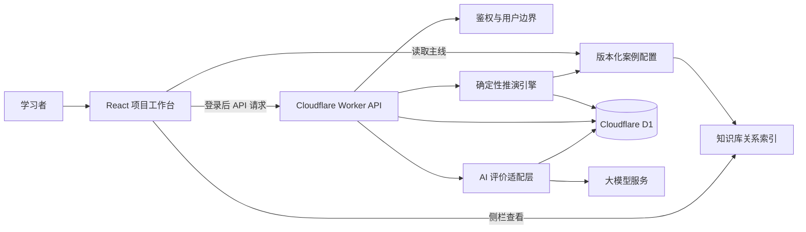
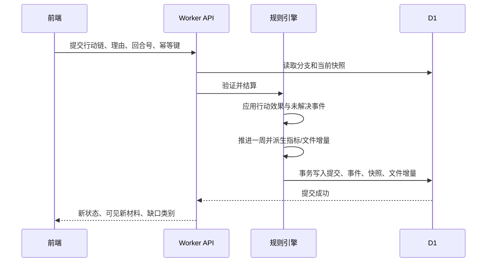

# 项目实验室 MVP 技术方案

- 版本：v0.1
- 对应 PRD：`项目实验室MVP-PRD-v0.1.md`
- 状态：技术设计草案；T1–T4 阻塞项已确认，T5–T10 待继续讨论
- 技术目标：在现有 PM Atlas 原型基础上，提供一个可配置、可复现、可保存、可解释的项目管理推演系统

## 1. 方案摘要

项目实验室不应实现为“根据用户选项临时拼接文案的问答页面”，而应实现为三层分离的系统：

1. **案例配置层**：只读、版本化的项目主线、情景、文件、行动卡和规则数据。
2. **确定性推演层**：由服务端规则引擎计算每周状态、文件更新、事件、后果和结局。
3. **解释性评价层**：AI 只基于案例事实、规则结果和用户决策记录生成教学复盘，不决定成败。

这三层分离是 MVP 的核心技术原则。它保证用户每次从同一节点做相同行动，都得到可重复、可追溯的结果；也使未来新增案例或调整教学规则时，不需要重写界面或数据库逻辑。

推荐的落地组合：

- 前端：现有 Next 16 + React 19 + TypeScript 原型。
- 运行时：现有 Cloudflare Worker + Vinext。
- 关系数据与用户进度：Cloudflare D1 + Drizzle ORM。
- 案例基线数据：代码仓库内的版本化 TypeScript/JSON 配置；后续可迁移到 R2 或内容管理系统。
- 用户文件分支版本：D1 中保存事件、快照和结构化增量；不复制整套 32 份文件。
- AI 评价：Worker 服务端适配层调用选定的大模型服务，返回受 JSON Schema 约束的结构化评价。

## 2. 现有技术基础与差距

### 2.1 可直接复用的能力

| 现有资产 | 位置 | 技术方案中的用途 |
|---|---|---|
| Next/React 原型 | `prototype/app` | 主线工作台、管理领域页面、文档工作区的 UI 基础 |
| Cloudflare Worker | `prototype/worker/index.ts` | API、规则引擎和 AI 评价服务的部署入口 |
| Drizzle 初始化 | `prototype/db/index.ts` | D1 数据访问统一入口 |
| 知识库索引与图谱 | `knowledge-base`、`prototype/app/knowledge-graph-data.ts` | 工具、技术、过程、项目文件的关联和侧栏联动 |
| 32 项目文件目录 | `prototype/app/project-document-data.ts` | 文件抽屉的完整文件集合 |
| 49 子过程与文件关系 | `prototype/app/management-area-data.ts` | 文档创建、引用、更新关系的基础图谱 |
| ChatGPT 登录辅助 | `prototype/app/chatgpt-auth.ts` | 登录态读取和前端页面保护的起点 |

### 2.2 当前缺口

1. `prototype/db/schema.ts` 为空，尚无 D1 表和迁移。
2. `.openai/hosting.json` 中 D1、R2 均为 `null`，运行环境没有持久化绑定。
3. Worker 只代理 Next/Vinext 和图片优化，没有实验室 API 或鉴权中间件。
4. 现有“实验室”页面是知识展示型原型，尚没有时间轴状态、分支、回合结算或行动链逻辑。
5. 现有 ChatGPT 登录辅助没有在页面或 Worker API 中实际使用。
6. 现有项目文件模板以展示和编辑为主，尚没有“主线版本 + 分支增量 + 差异比较”的版本模型。
7. 未配置 AI 服务、密钥管理、调用限流、结构化输出校验和费用控制。

## 3. 架构原则

### 3.1 确定性优先

项目状态、风险是否闭环、文件是否更新、是否达到结局门槛，都必须由确定性规则引擎处理。AI 不能改变状态，也不能把一条不满足硬门槛的路径解释为成功。

### 3.2 案例数据与运行数据分离

“汽车手机端控制应用上线项目”的主线、文件初始内容、情景、候选卡和规则是案例数据；用户的分支、选择、决策依据和 AI 评价是运行数据。案例升级不能悄悄改写已经完成的用户分支。

### 3.3 事件溯源 + 周快照

分支保存用户提交的行动、推演生成的事件和文档增量，同时在每回合保存可直接读取的状态快照。前者用于解释和重放，后者用于快速渲染仪表盘和比较。

### 3.4 结构化文档优先

文件版本差异需要结构化字段级更新，而非对整篇富文本进行模糊比较。MVP 中每份教学文件使用 JSON 内容模型和 JSON Patch 风格的变更记录，前端按文件类型渲染。

### 3.5 安全边界清晰

客户端只负责阅读案例、编辑行动链和提交理由；所有解锁、分支创建、结算、AI 请求和持久化由服务端验证。客户端绝不持有 AI 密钥，也不拥有改写主线数据的能力。

## 4. 总体架构



### 4.1 前端职责

1. 渲染主线回放、时间轴、15 项总览图表、10 个领域入口、文件抽屉和分支比较。
2. 在学习模式中展示当前可见材料、候选卡和知识库侧栏。
3. 提供行动链画布，校验基本连线完整性，但不负责业务规则判定。
4. 调用 API 加载/保存个人进度、创建分支、结算回合、读取版本差异、请求 AI 复盘。
5. 对未登录用户开放主线预览；当用户点击“从这里接手”时要求登录。

### 4.2 Worker API 职责

1. 识别登录用户，验证其对分支的所有权。
2. 加载指定案例版本和用户分支状态。
3. 验证提交的行动链仅包含当前情景允许的候选卡和合法连接。
4. 在事务中执行一周结算，生成新快照、事件和文件增量。
5. 返回已公开的新材料、指标变化和缺口类别，不返回理想答案。
6. 在场景结束或项目结束时调用 AI 评价适配层。
7. 记录审计信息、幂等键、错误和调用配额。

### 4.3 案例配置职责

案例配置是可审查、可测试、可版本控制的教学内容。它包含：

1. 主线 32 周基线状态和 6 个里程碑。
2. 15 项仪表盘的源数据或派生参数。
3. 32 份文件的初始版本、主线版本和关联关系。
4. 三个情景的触发材料、候选卡、必要动作、衍生事件和结局规则。
5. 每个行动的成本、时长、前提、影响、文件输出和副作用。
6. 与知识库节点的稳定 ID 映射。

## 5. 案例配置模型

### 5.1 目录建议

```text
content/lab-cases/
  car-control/
    v1/
      manifest.json
      milestones.json
      baseline-weeks.json
      dashboard-rules.json
      stakeholders.json
      actions.json
      scenarios/
        scenario-01.json
        scenario-02.json
        scenario-03.json
      documents/
        document-index.json
        D01/
        D02/
        ...
        D32/
      materials/
        emails/
        messages/
        reports/
```

案例在数据中以 `caseId + caseVersion` 标识，例如 `car-control:v1`。已保存分支永久引用该版本；升级内容时创建 `car-control:v2`，不得就地覆盖 `v1`。

JSON 保存周次、数值、卡片、关联、行动代价、状态影响和声明式规则；Markdown 保存邮件、消息和报告说明等叙事材料；结构化项目文件仍使用 JSON。TypeScript 只承载领域类型、规则引擎和读取接口。构建脚本在发布前校验源文件，并生成前端可读取的只读数据包。MVP 不开发可视化案例编辑器。

### 5.2 核心类型

```ts
type LabCase = {
  id: string;
  version: string;
  title: string;
  totalWeeks: 32;
  milestones: Milestone[];
  initialState: ProjectState;
  baselineWeeks: BaselineWeek[];
  scenarios: ScenarioDefinition[];
  documents: DocumentDefinition[];
  actions: ActionDefinition[];
};

type ProjectState = {
  week: number;
  scope: ScopeState;
  schedule: ScheduleState;
  cost: CostState;
  quality: QualityState;
  risk: RiskState;
  resources: ResourceState;
  stakeholders: StakeholderState;
  governance: GovernanceState;
};

type ScenarioDefinition = {
  id: string;
  entryWeek: number;
  visibleSignals: SignalDefinition[];
  candidateCardIds: string[];
  requiredActionGroups: RequiredActionGroup[];
  nextEvents: ConditionalEvent[];
  completionRules: CompletionRule[];
};

type ActionDefinition = {
  id: string;
  category: "tool" | "stakeholder" | "execution";
  preconditions: RuleExpression[];
  timeCostWeeks: number;
  cashCost: number;
  effects: StateEffect[];
  documentPatches: DocumentPatchTemplate[];
  knowledgeNodeIds: string[];
};
```

具体字段以实现期 TypeScript schema 为准，但案例配置必须通过运行时校验后才可部署。

### 5.3 主线基线与分支关系

主线基线保存“没有个人干预时，理想路径每周应是什么状态”。用户从第 N 周接手时：

1. 读取主线第 N 周的完整状态和已公开材料。
2. 以该状态创建分支根快照。
3. 后续状态只由该分支的行动、未处理事件和规则计算。
4. 比较视图以同周主线基线作为对照，不重新计算主线。

这使主线回放保持简单、稳定；分支推演只需要处理有限的 3 个高价值情景，而不需要把全部 32 周都建成开放世界模拟器。

## 6. 确定性推演引擎

### 6.1 输入

每次提交回合的服务端输入包括：

1. 分支 ID、预期回合序号和幂等键。
2. 当前情景 ID。
3. 用户选择的证据文档、工具技术、干系人、执行行动及连线关系。
4. 必填的三段式决策依据。
5. 当前案例版本和当前分支状态。

### 6.2 验证顺序

1. 鉴权：请求用户是否为分支所有者。
2. 乐观并发：提交中的预期回合序号是否仍等于分支当前回合。
3. 幂等：相同幂等键是否已经结算；若已结算则返回原结果。
4. 卡片范围：卡片是否属于当前情景的候选集合。
5. 连线语义：是否至少存在“证据 → 工具/行动 → 干系人”的有效链；禁止孤立卡片计入完成度。
6. 行动前提：所选行动是否满足可见证据、审批、资源或前置行动要求。
7. 理由完整性：三段式输入是否非空并满足最小长度；只校验格式，不由 AI 决定是否允许提交。

### 6.3 结算流程



### 6.4 规则表达方式

MVP 不建议设计可执行 JavaScript 或复杂 DSL，避免案例内容拥有任意代码执行能力。推荐使用受限的声明式规则：

```ts
type RuleExpression =
  | { op: "all"; rules: RuleExpression[] }
  | { op: "any"; rules: RuleExpression[] }
  | { op: "not"; rule: RuleExpression }
  | { op: "hasAction"; actionId: string }
  | { op: "hasCard"; cardId: string }
  | { op: "stateAtLeast"; path: StatePath; value: number }
  | { op: "stateBelow"; path: StatePath; value: number }
  | { op: "weekAtLeast"; value: number };
```

规则引擎只支持白名单操作符和白名单状态路径。这样内容作者可以组合教学规则，但不能突破服务端安全边界。

### 6.5 状态与图表计算

项目状态是业务真相；图表是从状态派生的只读视图。

| 状态域 | 主要字段示例 | 派生视图 |
|---|---|---|
| 范围 | 需求状态、已批准变更、范围基线版本 | 需求状态统计、WBS |
| 进度 | PV、EV、关键路径、任务预测日期 | SPI、里程碑甘特图、网络图、燃尽图 |
| 成本 | BAC、AC、EV、已承诺成本 | CPI、成本状态 |
| 质量与安全 | 测试通过率、阻断缺陷、高危风险 | 质量报告、上线门槛 |
| 风险与问题 | 概率、影响、应对状态、问题状态 | 风险矩阵、风险统计 |
| 资源 | 角色可用率、工作量、资源日历 | 项目工作量、资源详情 |
| 干系人 | 参与度、RACI、沟通任务 | 干系人参与度、RACI 矩阵 |
| 治理 | CCB 待办、审批、文件版本 | CCB 状态、文件抽屉 |

公式采用统一纯函数实现并覆盖单元测试。例如：

- `SPI = EV / PV`；
- `CPI = EV / AC`；
- 当分母为 0 时返回 `null` 和“尚无可计算数据”，不得显示误导性的 0 或无穷大；
- 安全、合规和阻断级缺陷属于硬门槛，不能被 SPI/CPI 抵消。

### 6.6 必要动作与冗余动作

为避免“全选即可通关”，每个情景不直接维护一份完整卡片答案，而维护若干**能力组**：

```ts
type RequiredActionGroup = {
  id: string;
  label: "影响评估" | "正式决策" | "执行处置" | "相关沟通";
  acceptedActionSets: string[][];
  requiredByWeek: number;
  missingEffect: StateEffect[];
};
```

例如“正式决策”可接受 `CCB 审查 + 变更请求`，而不是硬编码为一个按钮。引擎根据能力组是否满足决定风险是否闭环、何时恶化；额外的合法行动仍应用时间/成本副作用，因此用户可以成功但走出更昂贵的支线。

## 7. 文档与版本差异设计

### 7.1 文档数据模型

每份文件由定义、基线修订和分支增量组成：

```ts
type DocumentDefinition = {
  id: string;
  title: string;
  renderer: "table" | "form" | "timeline" | "matrix" | "richText";
  fields: DocumentFieldDefinition[];
  knowledgeNodeId: string;
};

type DocumentRevision = {
  documentId: string;
  revisionId: string;
  week: number;
  status: DocumentStatus;
  author: string;
  reason: string;
  content: JsonValue;
};

type DocumentDelta = {
  branchId: string;
  documentId: string;
  fromRevisionRef: string;
  week: number;
  patches: JsonPatchOperation[];
  reason: string;
  causedByEventId: string;
};
```

### 7.2 为什么不保存整份副本

每个分支若复制 32 份文件并在每周保存全量内容，会导致数据冗余、对比困难和案例升级风险。MVP 使用“主线版本 + 分支 patch”的叠加方式：

1. 加载文件时，先读取该周主线的最新基线修订。
2. 再按周顺序应用该分支的增量。
3. 差异视图展示两个已物化版本的字段级变化。
4. 对高频表格文件（风险登记册、变更日志、需求跟踪矩阵）优先记录行级新增/更新/删除；对富文本文件只做段落级差异。

### 7.3 文件状态机

`未建立 → 草拟 → 评审中 → 已批准 → 已基线化 → 已更新 → 已归档`

状态机只约束教学案例显示，不模拟真实组织的所有审批流。每次状态迁移必须关联一个项目事件、行动或主线周次。

## 8. D1 数据库设计

### 8.1 存储边界

D1 存储用户身份映射、解锁状态、分支、提交、事件、状态快照、文档增量和 AI 复盘。案例基线不依赖 D1，以便本地开发、测试和内容审查。

### 8.2 建议表

| 表 | 作用 | 核心字段 |
|---|---|---|
| `lab_users` | 登录用户的内部 ID 映射 | `id`, `identity_key`, `display_name`, `created_at` |
| `lab_case_versions` | 已发布案例版本登记 | `case_id`, `case_version`, `content_hash`, `published_at` |
| `lab_progress` | 用户对案例的解锁进度 | `user_id`, `case_id`, `case_version`, `highest_unlocked_week` |
| `lab_branches` | 用户个人分支 | `id`, `user_id`, `case_id`, `case_version`, `parent_branch_id`, `fork_week`, `status` |
| `lab_round_submissions` | 每回合提交的行动链与理由 | `id`, `branch_id`, `round_number`, `submission_json`, `reasoning_json`, `idempotency_key` |
| `lab_state_snapshots` | 每回合结算后的项目状态 | `branch_id`, `week`, `state_json`, `state_hash` |
| `lab_events` | 可回放的用户/系统事件 | `id`, `branch_id`, `week`, `event_type`, `payload_json`, `visibility` |
| `lab_document_deltas` | 分支文件增量 | `id`, `branch_id`, `document_id`, `week`, `patch_json`, `reason` |
| `lab_ai_reviews` | AI 结构化复盘 | `id`, `branch_id`, `scenario_id`, `review_json`, `model_ref`, `prompt_version` |

所有用户可读写表都应具备 `user_id` 或通过 `branch_id` 可回查到 `user_id`。API 查询必须先按用户边界过滤，再按资源 ID 查询，不能只按前端传入的分支 ID 读取。

### 8.3 事务与幂等

“提交一回合”必须在一个数据库事务中完成：

1. 锁定或条件更新当前分支回合版本。
2. 写入用户提交。
3. 写入规则结果、状态快照、文件增量和新事件。
4. 更新分支当前周次与状态。

`branch_id + idempotency_key` 建立唯一索引。网络重试必须返回第一次结算结果，不能重复扣减预算或推进周次。

### 8.4 数据保留

MVP 默认保存用户分支和 AI 评价。产品需提供“删除我的实验室数据”功能，级联删除用户分支、提交、快照、事件、文件增量和 AI 评价；案例只读基线不受影响。

## 9. API 设计

API 可由 Worker 在 `handler.fetch` 前拦截 `/api/lab/*` 路径实现，避免把规则引擎放入客户端。具体路径可在实施时调整，推荐资源语义如下：

| 方法 | 路径 | 用途 |
|---|---|---|
| `GET` | `/api/lab/cases/:caseId` | 获取案例元数据与用户解锁状态 |
| `GET` | `/api/lab/cases/:caseId/timeline?week=N` | 获取主线某周公开状态 |
| `POST` | `/api/lab/cases/:caseId/branches` | 从已解锁周次创建个人分支 |
| `GET` | `/api/lab/branches/:branchId` | 获取当前分支状态和回合上下文 |
| `POST` | `/api/lab/branches/:branchId/rounds` | 提交行动链并结算一周 |
| `GET` | `/api/lab/branches/:branchId/documents/:documentId?week=N` | 获取分支文件物化版本 |
| `GET` | `/api/lab/branches/:branchId/documents/:documentId/diff?from=A&to=B` | 获取文件差异 |
| `GET` | `/api/lab/branches/:branchId/compare?against=baseline` | 获取主线/分支比较数据 |
| `POST` | `/api/lab/branches/:branchId/reviews` | 请求情景或最终 AI 复盘 |
| `DELETE` | `/api/lab/me/data` | 删除当前用户实验室数据 |

### 9.1 返回数据原则

1. 客户端只能得到当前周已公开材料和自身分支数据。
2. API 不返回 `requiredActionGroups`、未触发事件、主线答案卡或后续周完整状态。
3. 用于比较和结局复盘的主线答案，只有在情景完成或项目结局后才返回。
4. 所有响应包含 `caseVersion`、`week`、`stateHash`，便于缓存失效和错误排查。

## 10. 鉴权、安全与隐私

### 10.1 登录方案

现有 `chatgpt-auth.ts` 从受信任请求头读取用户邮箱和姓名。技术上可复用其显示信息逻辑，但 Worker API 需要独立、明确地验证该身份来源。

推荐原则：

1. 在受平台认证保护的生产入口，才信任认证用户头。
2. 本地开发通过明确的开发身份开关或测试令牌模拟，不允许生产环境接受客户端自定义邮箱头。
3. 数据库不直接以可变展示名作为主键；使用稳定的身份键的哈希或平台提供的不可变 subject。
4. 未登录用户只读浏览主线；创建分支、保存、查看 AI 复盘要求登录。

### 10.2 AI 安全

1. AI 密钥仅存于 Worker 的加密环境变量，不进入前端包、案例文件或日志。
2. 向 AI 传递最小必要的模拟数据，不传递真实用户个人数据。
3. 用户填写的理由属于不可信输入；提示词中必须明确其不能覆盖系统规则、不能要求泄露答案或改变角色。
4. AI 输出必须是结构化 JSON，经服务端 schema 校验、长度限制和字段白名单处理后保存和展示。
5. AI 失败或超时不影响规则结算；界面显示“规则复盘已完成，AI 教练稍后可重试”。
6. 对每个用户/分支/场景限制 AI 请求次数，避免重复生成和费用失控。

### 10.3 数据与审计

1. 所有案例角色、邮件和项目文件均为虚构教学数据，不混入真实车主、车辆、供应商或生产系统数据。
2. 决策依据、行动链、AI 评价和删除操作写入审计事件。
3. 生产日志不得记录 AI 密钥、完整身份头或不必要的用户理由全文。

## 11. AI 评价实现

### 11.1 触发时机

1. 情景达到完成条件时生成情景复盘。
2. 分支达到项目结局时生成完整复盘。
3. 用户可对已完成情景手动重试生成；需遵守额度限制。

MVP 不在每周结算时强制调用 AI。即时反馈由规则引擎提供，避免延迟、成本和“AI 直接给答案”。

模型路由确定为：三个情景复盘使用 `gpt-5.6-luna`，项目最终复盘使用 `gpt-5.6-terra`。每条完整分支自动调用最多 4 次，每份复盘允许用户手动重试 1 次；相同分支状态的成功结果直接读取缓存。单条完整分支的目标 AI 成本不超过 0.20 美元，超出用户额度或全站预算保护阈值时仅提供规则复盘。

### 11.2 输入包

AI 输入应由服务端组装为受控事实包：

```ts
type ReviewInput = {
  caseSummary: string;
  scenarioSummary?: string;
  visibleEvidence: VisibleEvidence[];
  userRounds: UserRound[];
  ruleResults: RuleResult[];
  baselineComparison: BranchComparison;
  allowedAlternativePaths: AlternativePath[];
  knowledgeReferences: KnowledgeReference[];
};
```

不得把完整案例规则文件或未来未公开事件直接发送给模型。模型只需获得复盘所需的主线差异和允许替代解的摘要。

### 11.3 输出 Schema

```ts
type AiReview = {
  summary: string;
  strengths: ReviewFinding[];
  improvements: ReviewFinding[];
  capabilityProfile: {
    signalRecognition: "strong" | "developing" | "needs-practice";
    actionCompleteness: "strong" | "developing" | "needs-practice";
    timingAndTradeoff: "strong" | "developing" | "needs-practice";
    communicationAndGovernance: "strong" | "developing" | "needs-practice";
  };
  recommendedKnowledgeIds: string[];
  retrySuggestion: string;
};

type ReviewFinding = {
  claim: string;
  evidenceRefs: string[];
  impact: string;
};
```

前端只能渲染 schema 中定义的字段；若输出校验失败则不保存原始回复，记录脱敏错误并允许重试。

## 12. 前端模块拆分

| 模块 | 主要职责 | 数据来源 |
|---|---|---|
| `LabShell` | 周次、分支、抽屉和侧栏的全局布局 | 主线/分支状态 API |
| `TimelineReplay` | 32 周时间轴、6 里程碑、节点解锁 | 主线基线 + 进度 API |
| `Dashboard` | 15 项图表、异常入口 | `ProjectState` 派生视图 |
| `ManagementAreaPanel` | 10 个领域摘要与详情 | 状态域 + 知识库关系 |
| `DocumentDrawer` | 32 文件目录、状态、版本、差异 | 文档定义 + 物化版本 API |
| `SignalInbox` | 邮件、消息、报告、告警 | 当前周可见 `lab_events` |
| `ActionChainCanvas` | 候选卡、连线、理由填写、提交 | 当前情景定义 + 本地编辑状态 |
| `RoundResultPanel` | 一周结算后果与缺口类别 | 回合结算响应 |
| `BranchCompare` | 主线与多分支对比 | 比较 API |
| `AiReviewPanel` | 结果等级、能力画像、AI 复盘 | `lab_ai_reviews` |
| `KnowledgeSidePanel` | 工具、技术、文件的知识库说明 | 静态知识图谱数据 |

### 12.1 图表技术建议

MVP 图表优先使用 SVG/HTML/CSS 实现，或选择体积小且支持 React 19 的图表库。原因：

1. 数据量非常小（32 周、15 个图表、3 个情景），不需要大型 BI 组件。
2. 甘特图、网络图、WBS 和 RACI 更需要可控布局与点击联动。
3. 所有图表必须根据同一 `ProjectState` 重新渲染，避免每张图自行维护状态。

若引入第三方库，需先确认其兼容 Next 16/Vinext、SSR 和 Cloudflare Worker 构建环境。

## 13. 实施阶段

### 阶段 0：技术底座

1. 启用 D1 绑定，定义 Drizzle schema 和迁移。
2. 建立 Worker API 路由、统一鉴权和错误响应。
3. 建立案例配置 TypeScript 类型、运行时校验和测试夹具。
4. 将现有知识库 ID 与案例卡片 ID 建立映射。

### 阶段 1：只读主线工作台

1. 完成 `car-control:v1` 的 32 周主线基线和 32 份文件主线版本。
2. 实现时间轴、里程碑、15 项仪表盘、10 个管理领域入口和文件抽屉。
3. 实现主线时点切换、文件关联高亮和知识库侧栏。
4. 支持未登录只读预览。

### 阶段 2：分支与规则引擎

1. 实现登录后解锁、创建分支、回合提交和云端保存。
2. 完成第一个情景的候选卡、行动链、回合结算、文件增量和复盘比较。
3. 验证幂等、并发、分支隔离和未来信息不泄露。
4. 再配置第二、第三个情景，复用同一引擎。

### 阶段 3：AI 复盘与完善

1. 接入 AI 评价适配层和结构化输出校验。
2. 实现能力画像、知识库推荐和 AI 失败重试。
3. 完成跨分支比较、数据删除和使用配额。
4. 进行学习可用性测试，调整候选卡规模、提示和规则阈值。

## 14. 测试与质量保障

### 14.1 单元测试

1. SPI、CPI、风险等级、质量门槛、结局判定等纯函数。
2. 行动前提、能力组、冗余动作和缺失动作规则。
3. 文件 patch 应用、版本物化和差异生成。
4. 案例配置 schema 校验及 32 周数据完整性校验。

### 14.2 集成测试

1. 创建分支后，第 N 周状态与主线基线一致。
2. 提交一次行动链只推进一周；相同幂等键不重复结算。
3. 不同用户无法读取或修改彼此分支。
4. 未解锁节点不能创建分支。
5. API 不会在情景结束前返回理想答案或未来事件。
6. 三个理想行动链可得到 PRD 指定的主线结果。

### 14.3 端到端测试

1. 主线回放、文件抽屉、知识侧栏和仪表盘联动。
2. 从第 9、17、25 周创建分支并完成一轮推演。
3. 每回合必须填写理由才可提交。
4. 情景结束后显示差异和 AI 评价；AI 不可用时仍能完成规则复盘。

### 14.4 内容验证脚本

建议新增 `scripts/validate-lab-case.mjs`，在构建前验证：

1. 6 个里程碑和 32 个周快照完整。
2. 15 项仪表盘所需字段在每个周快照均可计算。
3. 32 份项目文件均有定义、关联知识节点和至少一个生命周期状态。
4. 每个情景的候选卡数量为 12–16，最小正确集合为 5–7。
5. 情景事件发生周次分别为 9、17、25。
6. 所有行动、文档、干系人与知识库 ID 引用均存在。
7. 主线结局满足硬门槛，失败路径确实违反至少一个明确规则。

## 15. 性能与运维

### 15.1 性能目标

1. 主线某周状态和文件目录的 API 响应目标：P95 小于 500ms（不含首次冷启动）。
2. 回合结算目标：P95 小于 1 秒；不得依赖 AI 同步完成。
3. AI 复盘采用异步/可重试体验，避免阻塞情景结算。
4. 前端首次只加载当前周和图表所需数据；文件正文、详细差异和知识侧栏按需加载。

### 15.2 观测性

记录但脱敏：

1. API 端点延迟、错误率和 D1 查询失败。
2. 回合结算成功率、幂等命中率、规则校验失败类型。
3. AI 调用次数、延迟、失败率、schema 校验失败率和单用户配额。
4. 案例配置校验失败和无法解析的知识库映射。

## 16. 技术决策与待讨论问题

T1–T4 已确认并转为实施约束；T5–T10 仍需继续讨论。

### T1. 登录身份的可信来源（已确认）

现有代码只读取 `oai-authenticated-user-email` 等请求头，且尚未被实际使用。需要确认生产托管环境是否保证这些头只能由可信认证层注入，并是否提供稳定的不可变用户 ID。

**确认决策**：MVP 沿用平台登录，暂时不提供普通浏览器中的独立账号注册。未登录用户可只读浏览知识库和项目主线；创建分支、云端保存和 AI 复盘必须登录。服务端优先使用平台提供的稳定 subject；若只能获得邮箱，则保存规范化邮箱的不可逆哈希作为内部身份键。生产环境不得信任客户端自行构造的身份头。

### T2. AI 服务、模型、预算与可用性（已确认）

PRD 已确定 AI 负责复盘，但尚未确定调用哪一个服务、每次调用预算、是否允许流式输出、超额行为和隐私条款。

**确认决策**：使用 OpenAI Responses API。三个情景复盘使用 `gpt-5.6-luna`，项目最终复盘使用 `gpt-5.6-terra`。每条完整分支最多自动调用 4 次，每份复盘允许手动重试 1 次；使用结构化输出、结果缓存、单次 token 上限、用户额度和全站预算保护。单条完整分支目标成本不超过 0.20 美元；AI 不可用或超额时只提供规则复盘，不阻塞推演。

### T3. 32 份文件的内容粒度（已确认）

“能查看文件版本和 Git 式 diff”要求每份文件有真实的结构和多周版本。若 32 份文件均做成长篇富文本，内容制作和差异准确性会显著膨胀。

**确认决策**：32 份文件全部提供真实可查看内容。以下 18 份核心动态文件维护完整结构、主线版本和分支版本链：假设日志、变更日志、成本估算、问题日志、里程碑清单、项目沟通记录、项目进度计划、项目范围说明书、项目团队派工单、质量报告、需求文件、需求跟踪矩阵、资源日历、风险登记册、风险报告、进度数据、进度预测、测试与评估文件。其余 14 份支撑文件维护真实内容、生命周期状态和 1–2 个关键版本。文件按事件更新，不按周机械生成版本。

### T4. 案例配置的制作方式（已确认）

案例需要 32 周主线、3 个情景、15 项仪表盘、行动规则和文件版本。若手工散落在 React 组件中，后续维护不可控。

**确认决策**：JSON/Markdown 作为案例源文件，构建时执行完整性和引用校验，并生成应用使用的只读数据包。JSON 管理结构化数据和声明式规则，Markdown 管理叙事材料，TypeScript 只管理类型、引擎和读取接口。MVP 不开发内容后台；配置稳定后再评估案例作者工具。

### T5. 行动链的图形交互复杂度（需要产品确认）

自由拖拽图编辑器会增加移动端适配、可访问性、连线命中和状态恢复的实现复杂度，且可能偏离学习目标。

**推荐决策**：MVP 使用受约束的分栏连线工作区：卡片按“证据、工具、行动、干系人”分区，连线只允许相邻或预定义语义关系；提供键盘/点击式替代交互。不引入通用画布或无限自由布局。

### T6. 多分支比较的上限（需要产品确认）

用户可从节点反复接手。无限制加载分支会使比较页面、AI 输入和 D1 查询复杂化。

**推荐决策**：MVP 保存分支数量不设硬上限，但比较界面一次最多选择主线加 3 条个人分支；AI 最终评价一次只评价 1 条分支。

### T7. 项目文件的编辑权限（需要产品确认）

PRD 当前要求用户选择证据文档、查看行动导致的输出文档差异，并未明确用户是否应手工编辑文件内容。

**推荐决策**：MVP 的推演文件只读，用户通过行动链触发预设更新；“手工填写变更请求/风险登记册”列为后续迭代。这样规则引擎可保持确定性。

### T8. 主线访问与用户解锁策略（需要产品确认）

PRD 定义首次必须观看主线后才能接手，但需要明确“观看”的技术判定，防止用户只拖到节点即解锁。

**推荐决策**：MVP 将“到达节点、展开该节点的主线材料、停留并打开至少一份指定证据”作为解锁条件；不强制视频式停留时长，避免形式化打卡。

### T9. 图表实现与移动端范围（需要产品确认）

15 项图表同时适配小屏会显著影响 MVP 时间，尤其是网络图、WBS、RACI 和行动链。

**推荐决策**：MVP 以桌面端（最小 1024px 工作台）为正式体验目标；移动端提供主线阅读和简单复盘，不承诺完整行动链编辑。

### T10. 案例数据的数值校准（内容/教学风险）

SPI、CPI、成本、工作量、风险和满意度需要一套连贯数值。若只为图表而填数，会出现“SPI 改善但关键路径更差”等不合理现象，削弱学习可信度。

**推荐决策**：先编制 32 周的任务/成本/风险基线表，再由纯函数派生仪表盘数据；不要从 15 张图表分别手填数字。建议由项目管理专家共同审阅 3 个情景的每周变化。

## 17. 建议的下一步

1. 继续确认 T5–T10，明确交互、比较、文件编辑、解锁、终端范围和数值校准边界。
2. 编制 `car-control:v1` 案例源文件骨架，先只覆盖第 9 周情景一及相关文件。
3. 完成 D1 schema、Worker API、分支和单回合结算的纵向切片。
4. 用第一个情景验证“状态引擎 + 文件差异 + AI 复盘”的完整闭环后，再扩展至情景二和情景三。
