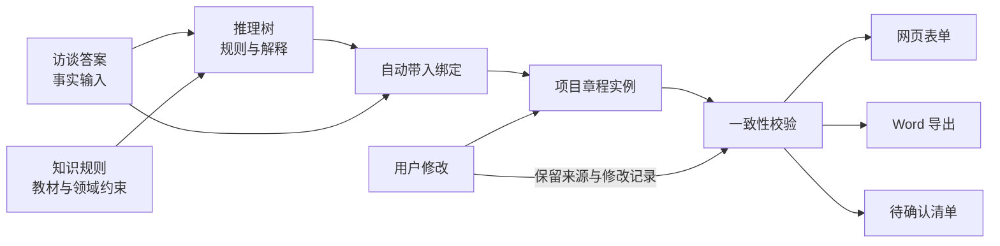
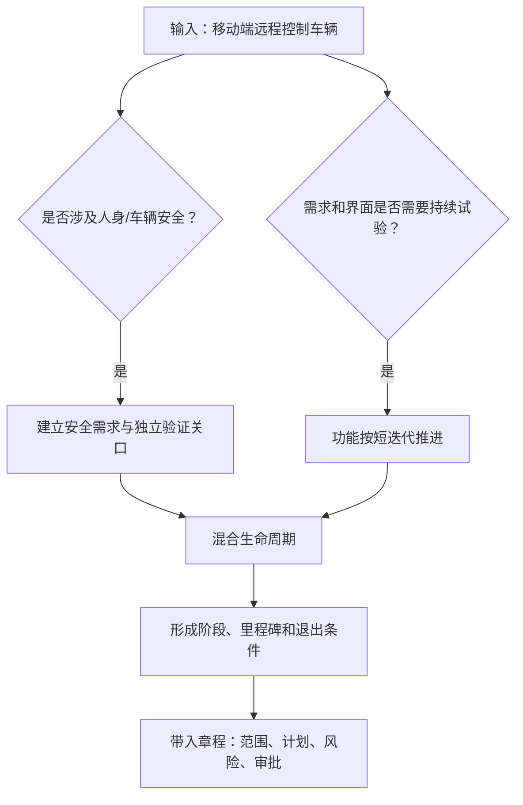

# 项目章程模板规范 v0.1

> 目标：把“项目章程”从一张静态文档，拆成网站能够访谈、推理、解释、编辑和导出 Word 的结构化产品对象。首个验证场景为“汽车手机端控制应用”。

## 1. 用户结果

刚接到任务的项目经理不需要先理解整份教材，只需完成一轮引导式访谈，即可得到：

1. 一棵可回溯的项目判断树；
2. 一份带证据状态的章程草案；
3. 一张“仍需向谁确认什么”的待办清单；
4. 一份可以继续编辑并导出 Word 的正式文档骨架。

系统不是替用户作出组织级批准，而是帮助用户把已知事实、专业推断和待确认事项分开。

## 2. 数据对象与关系

对应文件：

- 字段定义：`schemas/project-charter.schema.json`
- Word 映射：`schemas/project-charter.word-map.json`
- 访谈样本：`samples/car-control-app/interview.json`
- 推理树样本：`samples/car-control-app/reasoning-tree.json`
- 章程实例：`samples/car-control-app/project-charter.json`

## 3. 值的四种状态

每个可填写字段使用统一的“值信封”，至少包括 `value`、`status`、`sourceIds` 和 `lastUpdatedAt`。

| 状态 | 含义 | 网页表现 | Word 表现 | 能否直接用于批准 |
|---|---|---|---|---|
| `confirmed` | 由用户或权威材料明确给出 | 实心勾与“已确认” | 正常文字 | 可以 |
| `inferred` | 系统依据事实和规则推导 | 紫色“推断”标签，可展开理由 | 正常文字并进入追踪附录 | 需用户复核 |
| `assumed` | 为了形成可讨论草案而暂定 | 琥珀色“假设”标签 | 标注“暂定” | 不可以，除非转为已确认 |
| `missing` | 必要信息尚不存在 | 红色“待确认”与追问入口 | 显示“待确认” | 不可以 |

核心原则：系统不得把推断伪装成事实，不得编造预算金额、人员姓名、批准结论或组织授权。

## 4. 字段分组

字段的机器可读约束、类型、选项和自动带入规则以 Schema 为准。网页按以下顺序展示：

| 分组 | 主要字段 | 典型来源 | 关键校验 |
|---|---|---|---|
| 文档控制 | 项目名称、版本、状态、编制/批准日期 | 项目基本情况、系统 | 已批准必须有批准日期 |
| 目的与价值 | 项目目的、业务需求、预期价值 | 发起背景、业务访谈 | 价值要能连接到目标 |
| 项目目标 | 指标、目标值、期限、验证方式、责任角色 | 成功标准访谈、推理 | 每项目标必须可测量 |
| 范围与交付 | 高层需求、边界、交付物、不在范围 | 需求与约束访谈 | 边界与交付物不能冲突 |
| 整体风险 | 高层风险摘要 | 风险登记册 | 安全/合规重大风险必须进入关口 |
| 里程碑 | 日期、退出条件、责任角色 | 截止日期、生命周期推理 | 日期递增，退出条件可验证 |
| 财务资源 | 预算总额、币种、来源、分配 | 发起人/财务 | 缺预算只允许导出草案 |
| 干系人 | 角色、影响、参与方式 | 组织访谈、推理 | 必须识别最终批准角色 |
| 审批与退出 | 验收要求、批准流程、退出标准 | 治理规则、约束 | 退出标准必须可检查 |
| 项目经理与发起人 | 人员/角色、职责、权限、批准结论 | 组织授权 | 姓名或授权缺失时阻止批准 |

## 5. 填写逻辑

### 5.1 访谈组织

访谈不按文档章节机械提问，而按新项目经理更容易回答的语境分成六组：

1. 为什么做：触发事件、业务问题、预期价值；
2. 做到什么程度：对象、核心能力、首发边界、不包含什么；
3. 什么算成功：可测量指标、日期、验证方法；
4. 有哪些硬约束：安全、隐私、合规、接口、供应商、技术条件；
5. 谁决定和参与：发起人、项目经理、产品、研发、测试、运营、法务；
6. 已知与未知：预算、资源、首批车型/地区、批准关口。

访谈支持“暂时不知道”。不知道不会阻断草案生成，而会产生 `missing` 字段和后续追问。

### 5.2 推理与自动带入

自动带入遵循以下优先级：

1. 用户明确确认的答案；
2. 项目已有的权威资料；
3. 可解释的规则推断；
4. 为便于讨论而生成的假设；
5. 无依据则保持待确认。

当用户修改自动生成的内容时，系统保留原始来源和推理路径，将新值记录为用户确认或覆盖，不静默丢失追踪信息。

### 5.3 跨字段规则

- 文档状态为“已批准”时，必须存在批准日期、发起人和批准结论。
- 批准预算缺失时，可以预览和导出“推演草案”，不能标记为已批准。
- 项目经理或发起人未指定时，封面与审批区必须显示“待确认”。
- 识别到安全或合规高等级风险时，验收要求和里程碑必须包含对应基线或验证关口。
- 可测量目标、里程碑退出条件与最终验收方式需要互相对应。

## 6. 网页交互

页面采用“左侧推理、右侧文档”的双栏工作台：

- 左栏显示当前访谈步骤、推理树和来源；
- 右栏显示章程实时预览，可直接修改字段；
- 点击字段的状态标签，可查看“答案 → 规则 → 结果”的证据链；
- 顶部显示完整度，但把“已填比例”和“可批准状态”分开；
- 底部固定显示“仍需确认的 3 件事”，提供继续访谈入口；
- 允许用户在教材视角与实践视角之间切换，字段本身不重复存储。

建议的轻游戏化反馈是“项目清晰度”而不是分数竞赛：事实越完整、约束越明确、冲突越少，地图中的迷雾逐步消散。

## 7. Word 导出结构

Word 是章程实例的一个视图，不另存一套业务数据。导出顺序为：

1. 标题区：名称、状态、版本和日期；
2. 推演结论提示：建议生命周期与原因；
3. 项目目的与预期价值；
4. 可测量的目标与成功标准；
5. 高层级范围、需求和交付成果；
6. 总体里程碑计划；
7. 整体项目风险；
8. 财务资源与关键干系人；
9. 审批要求与退出标准；
10. 项目经理与发起人权限；
11. 附录 A：自动带入与推理追踪；
12. 附录 B：待确认事项和批准阻断项。

导出规则：

- 章程正文保持组织可用的正式表达；
- 推理解释集中到附录，避免正文像 AI 对话记录；
- `missing` 统一渲染为“待确认”，并在封面显示草案警示；
- 表格保持语义表头，跨页重复表头，不依赖颜色表达唯一含义；
- 导出后允许人工编辑，但再次导入或同步不属于当前 MVP。

## 8. MVP 验收标准

- 能从访谈样本生成完整章程草案；
- 任一自动填入字段都能回溯到答案或推理节点；
- 缺失预算、项目经理和发起人时不会伪造内容，也不会误判为可批准；
- Word 包含正文、追踪附录和待确认事项，版式可直接用于评审；
- JSON 校验脚本能识别悬空来源、推理树断边和状态错误。

