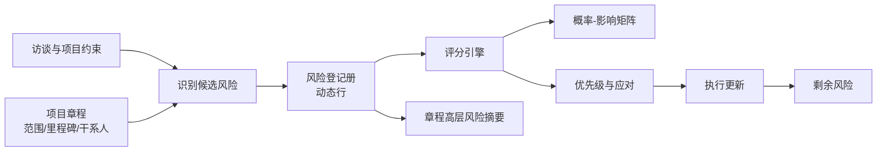

# 风险登记册模板规范 v0.1

> 目标：用第二个连续样本验证表格型模板能力，包括动态行、概率与影响评分、矩阵联动、风险应对和剩余风险跟踪。

## 1. 与项目章程的连续关系

风险登记册不是孤立模板。章程中的“整体项目风险”是登记册的摘要视图；登记册则保存每项风险的原因、事件、影响、评分、责任人、应对和剩余风险。

对应文件：

- 行结构：`schemas/risk-register.schema.json`
- 评分规则：`schemas/risk-scoring-rules.json`
- 样本实例：`samples/car-control-app/risk-register.json`

## 2. 动态行模型

每一行是一条稳定 ID 的风险对象。用户可以新增、复制、排序、筛选、归档或关闭一行；行编辑在侧边面板完成，矩阵与汇总视图实时更新。

一行分为六组信息：

1. 识别：编号、威胁/机会、标题、类别；
2. 风险陈述：原因、可能发生的事件、影响；
3. 固有评分：概率、七个影响维度、综合影响、分数、等级；
4. 应对：责任角色、策略、行动、触发条件、应急计划和日期；
5. 剩余评分：实施应对后重新评估的概率、影响、分数和等级；
6. 治理：状态、来源、更新时间和说明。

风险描述强制拆成“由于……可能发生……从而导致……”，避免只记录含糊的“进度风险”。

## 3. 评分方法

### 3.1 概率

| 分值 | 概率区间 | 解释 |
|---:|---|---|
| 1 | 小于 2% | 极低 |
| 2 | 2%–不足 10% | 低 |
| 3 | 10%–不足 30% | 中 |
| 4 | 30%–50% | 高 |
| 5 | 大于 50% | 极高 |

### 3.2 影响

分别评价范围、进度、成本、质量、安全、隐私和合规七个维度，均采用 1–5 分。综合影响取最高值：

`综合影响 = max(范围, 进度, 成本, 质量, 安全, 隐私, 合规)`

这样做是为了避免安全、隐私或合规风险被其他维度平均稀释。维度定义与阈值以评分规则 JSON 为准。

### 3.3 分数与等级

`风险分数 = 概率 × 综合影响`

| 分数 | 等级 | 默认处理 |
|---:|---|---|
| 1–4 | 低 | 观察或接受 |
| 5–9 | 中 | 指定责任人并规划应对 |
| 10–16 | 高 | 纳入重点跟踪和里程碑关口 |
| 17–25 | 严重 | 升级给发起人/治理层并立即处理 |

安全或合规影响为 5 时，即使乘积分数较低，等级也不得低于“高”。界面需同时保留原始分数和抬升后的等级，并解释原因。

### 3.4 剩余风险与机会

- 威胁经过应对后，剩余概率或影响高于固有值时必须填写解释；
- 机会风险采用开拓、提高、分享、接受等策略；
- 对机会进行“提高”后，出现概率或正面影响可能上升，这是计划结果，不应被错误判为评分异常；
- 高或严重风险必须有责任角色、应对措施和完成日期。

## 4. 概率—影响矩阵

矩阵纵轴为概率、横轴为综合影响，每个单元格由同一套评分规则计算等级。

| 概率＼影响 | 1 | 2 | 3 | 4 | 5 |
|---:|---|---|---|---|---|
| 5 | 中 | 高 | 高 | 严重 | 严重 |
| 4 | 低 | 中 | 高 | 高 | 严重 |
| 3 | 低 | 中 | 中 | 高 | 高 |
| 2 | 低 | 低 | 中 | 中 | 高 |
| 1 | 低 | 低 | 低 | 低 | 中 |

交互要求：

- 单元格显示数量和风险编号，威胁与机会使用不同符号而不只依赖颜色；
- 点击单元格过滤表格行；点击风险点打开侧边编辑器；
- 支持在“固有风险”和“剩余风险”之间切换；
- 安全/合规兜底规则造成的等级抬升，要在点位旁显示盾牌标记；
- 矩阵色板遵循低→严重的绿、黄、橙、红，但文字和图形标签必须同时存在。

## 5. 页面结构

风险工作台由四层组成：

1. 顶部摘要：总数、严重/高风险数、本周到期数、责任人缺失数；
2. 视图切换：登记册、矩阵、类别、责任人、应对看板；
3. 主视图：可排序和筛选的动态行表格；
4. 侧边面板：完整风险陈述、评分、行动、触发与历史。

新增风险时先用简短引导收集“原因—事件—影响”，系统再建议类别、影响维度和候选责任角色；评分建议必须由用户确认。

## 6. 样本验证点

汽车手机端控制应用样本覆盖：

- 安全、隐私、合规、技术接口、供应链、进度和采用率等类别；
- 8 条威胁和 1 条机会；
- 严重、高、中、低等级及安全/合规最低等级规则；
- 固有风险与剩余风险对比；
- 机会经“提高”策略后剩余机会等级上升；
- 风险摘要回填到项目章程。

## 7. MVP 验收标准

- 可新增、编辑和删除动态行，编号保持稳定；
- 修改概率或任一影响维度时，综合影响、分数、等级和矩阵位置同时刷新；
- 矩阵规则与行内评分使用同一个配置源；
- 高/严重风险缺责任人、行动或期限时立即提示；
- 固有/剩余评分和汇总数量可由校验脚本重新计算并完全一致；
- 章程引用风险登记册摘要，不复制为无法同步的独立文本。

