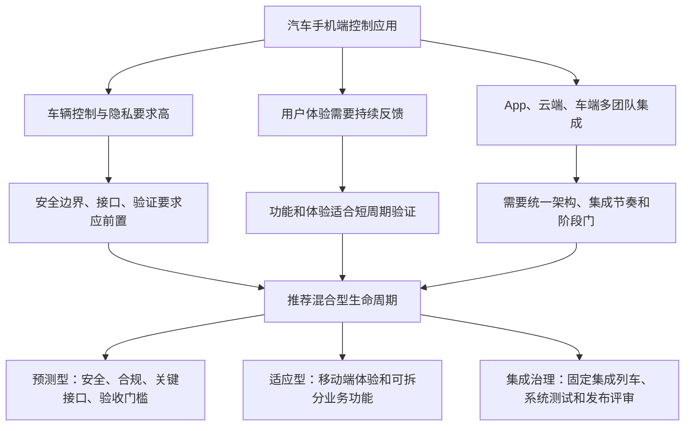

# 知识建模样本：开发方法与生命周期 v0.1

> 来源样本：Obsidian 笔记 `开发方法和生命周期绩效域.md`  
> 用途：验证“教材知识 → 结构化关系 → 推理规则 → 项目行动”的产品链路  
> 状态：待用户与教材原文校核，不作为最终规则

## 1. 样本目标

用户输入项目情况后，系统需要回答：

1. 更适合预测型、混合型还是适应型开发方法？
2. 应采用一次、多次、定期还是持续交付？
3. 哪些部分应该前置规划，哪些部分应该迭代？
4. 这个判断基于哪些项目事实？
5. 下一步需要开展哪些管理活动并形成哪些交付物？

## 2. 教材知识对象

### 2.1 一级对象

| ID | 类型 | 名称 | 作用 |
|---|---|---|---|
| `PD-LC-01` | 绩效域 | 开发方法和生命周期 | 组织交付节奏、开发方法和项目阶段 |
| `C-CADENCE` | 概念 | 交付节奏 | 描述交付物的时间安排和频率 |
| `C-APPROACH` | 概念 | 开发方法 | 描述形成项目交付物的工作方式 |
| `C-LIFECYCLE` | 概念 | 项目生命周期 | 描述从启动到收尾的阶段组织方式 |
| `D-APPROACH` | 决策 | 开发方法选择 | 根据项目情境选择合适方法 |

### 2.2 交付节奏

| ID | 名称 | 核心特征 | 常见适用情境 |
|---|---|---|---|
| `CAD-ONCE` | 一次性交付 | 项目末期集中交付 | 交付物不可拆分或上线前必须整体完成 |
| `CAD-MULTI` | 多次交付 | 不同组件在不同时间交付 | 多组件项目 |
| `CAD-PERIODIC` | 定期交付 | 按固定周期发布 | 产品版本、定期业务发布 |
| `CAD-CONTINUOUS` | 持续交付 | 小批量、自动化、频繁发布 | 数字产品和稳定产品团队 |

### 2.3 开发方法

| ID | 名称 | 主要信号 | 管理侧重点 |
|---|---|---|---|
| `APP-PREDICTIVE` | 预测型 | 需求和范围稳定、变更成本高、强安全或监管约束 | 前置规划、基准、阶段门、变更控制 |
| `APP-HYBRID` | 混合型 | 同时存在稳定约束和探索性工作，或可交付物可模块化 | 按工作流裁剪方法、整合节奏、接口与阶段门 |
| `APP-ADAPTIVE` | 适应型 | 需求易变、需要持续反馈、变更相对容易 | 短周期、持续参与、滚动规划、价值优先 |

## 3. 有类型的知识关系

| 主体 | 关系 | 客体 |
|---|---|---|
| 开发方法和生命周期绩效域 | 包含关注点 | 交付节奏 |
| 开发方法和生命周期绩效域 | 包含关注点 | 开发方法 |
| 开发方法和生命周期绩效域 | 包含关注点 | 项目生命周期 |
| 预测型方法 | 适用于 | 高需求确定性 |
| 预测型方法 | 适用于 | 高安全或监管约束 |
| 适应型方法 | 适用于 | 高需求易变性 |
| 适应型方法 | 依赖 | 高频干系人参与 |
| 混合型方法 | 适用于 | 可模块化的多团队交付物 |
| 开发方法选择 | 受影响于 | 产品特征 |
| 开发方法选择 | 受影响于 | 项目约束 |
| 开发方法选择 | 受影响于 | 组织环境 |
| 开发方法 | 影响 | 规划方式 |
| 开发方法 | 影响 | 团队工作方式 |
| 开发方法 | 影响 | 风险控制方式 |
| 交付节奏 | 影响 | 生命周期阶段安排 |

这比无类型的 Wiki 链接更适合知识图谱和推理引擎。

## 4. 项目访谈字段

用户不需要理解“预测型”或“适应型”，系统通过自然问题收集以下事实：

### 4.1 产品与交付物

| 字段 | 问法示例 | 值域 |
|---|---|---|
| `innovation_level` | 团队以前做过类似产品吗？ | 低 / 中 / 高 |
| `requirement_certainty` | 核心需求现在清楚到什么程度？ | 低 / 中 / 高 |
| `scope_stability` | 未来半年需求发生较大变化的可能性？ | 低 / 中 / 高 |
| `change_cost` | 产品建成后修改的代价有多大？ | 低 / 中 / 高 |
| `modularity` | 产品能否拆成可独立验证或交付的模块？ | 低 / 中 / 高 |
| `safety_criticality` | 出错是否会影响人身、财产或关键业务安全？ | 低 / 中 / 高 |
| `regulatory_intensity` | 是否存在强制法规、认证或审计要求？ | 低 / 中 / 高 |

### 4.2 项目条件

| 字段 | 问法示例 | 值域 |
|---|---|---|
| `stakeholder_availability` | 关键用户能否持续参与评审？ | 低 / 中 / 高 |
| `early_delivery_need` | 是否必须尽早交付部分可用能力？ | 低 / 中 / 高 |
| `deadline_rigidity` | 上线日期是否不可移动？ | 低 / 中 / 高 |
| `funding_certainty` | 预算是否一次性明确并获批？ | 低 / 中 / 高 |
| `external_dependencies` | 对供应商、车端或外部平台的依赖程度？ | 低 / 中 / 高 |

### 4.3 组织与团队

| 字段 | 问法示例 | 值域 |
|---|---|---|
| `organizational_agility` | 组织是否支持团队快速决策和调整？ | 低 / 中 / 高 |
| `team_experience` | 团队使用迭代方式的经验如何？ | 低 / 中 / 高 |
| `team_distribution` | 团队是否跨组织、跨地域？ | 低 / 中 / 高 |
| `governance_formality` | 是否需要正式审批、基准和阶段评审？ | 低 / 中 / 高 |

## 5. 第一版推理规则

规则不直接得出唯一答案，而是向不同开发方法增加或减少支持，并保存解释。

| 规则 ID | 条件 | 推理影响 | 用户可见解释 |
|---|---|---|---|
| `R-LC-001` | 需求确定性高且范围稳定 | 支持预测型 | 主要工作可以在早期定义和规划 |
| `R-LC-002` | 需求易变且需要频繁用户反馈 | 支持适应型 | 短周期验证可以降低做错需求的风险 |
| `R-LC-003` | 安全关键性高 | 强化预测型治理 | 安全需求、验证和追踪需要前置并受控 |
| `R-LC-004` | 监管强度高 | 强化预测型治理 | 需要更完整的文档、审查和合规证据 |
| `R-LC-005` | 可交付物高度模块化 | 支持混合型或增量型 | 不同模块可以采用不同节奏逐步集成 |
| `R-LC-006` | 多团队或外部依赖高 | 支持混合型 | 接口和里程碑需要前置协调，局部工作仍可迭代 |
| `R-LC-007` | 变更成本高 | 支持前置规划 | 越晚改变成本越高，应尽早确认关键约束 |
| `R-LC-008` | 早期交付需求高 | 支持迭代或增量 | 可以先交付价值较高的可用子集 |
| `R-LC-009` | 干系人持续参与能力低 | 限制纯适应型 | 高频反馈机制可能无法稳定运行 |
| `R-LC-010` | 团队敏捷经验低 | 限制纯适应型 | 需要增加方法辅导、治理和过渡安排 |
| `R-LC-011` | 治理正式度高且需求仍易变 | 支持混合型 | 保留正式决策与基准，同时允许局部迭代 |
| `R-LC-012` | 多组件采用不同交付节奏 | 支持生命周期阶段重叠或重复 | 需要按组件组织集成和发布节奏 |

### 5.1 推理规则的产品要求

每次规则触发都要保留：

- 使用了哪个项目事实；
- 事实由用户提供还是系统推断；
- 支持或反对哪种方案；
- 对应的教材知识；
- 规则是否已经人工审核；
- 如果修改事实，哪些结论需要重新计算。

## 6. 汽车手机端控制应用推演样本

以下项目事实是为了验证产品而设置的初始假设，尚未作为最终案例设定：

| 事实 ID | 项目事实 | 初步判断 |
|---|---|---|
| `F-01` | 涉及车门、空调等车辆远程控制 | 安全关键性高 |
| `F-02` | 涉及账号、位置和车辆数据 | 安全、隐私和合规要求高 |
| `F-03` | 移动端体验需要车主反馈 | 部分需求确定性中低 |
| `F-04` | 系统由 App、云端、车端和第三方组件组成 | 模块化与集成复杂度高 |
| `F-05` | 多个内部团队和供应商共同交付 | 外部依赖与协调复杂度高 |
| `F-06` | 车辆接口和安全机制后期修改成本高 | 关键技术变更成本高 |
| `F-07` | App 功能需要分版本发布 | 存在定期或多次交付需求 |

### 6.1 推理树



### 6.2 为什么不是纯预测型

- 移动端体验和部分业务需求需要真实反馈；
- 全部需求在前期冻结，可能提高“按计划完成但用户价值不足”的风险；
- 多个可拆分功能适合逐步验证。

### 6.3 为什么不是纯适应型

- 车辆控制安全边界不能只在迭代中逐渐发现；
- 车端和云端接口变更成本高；
- 合规、审计、测试证据和发布审批需要正式治理；
- 多组织依赖需要明确集成基线和里程碑。

### 6.4 初步生命周期

| 阶段 | 主要方法 | 关键活动 | 主要交付物 |
|---|---|---|---|
| 机会与立项 | 预测型治理 | 明确价值、范围边界、相关方和约束 | 项目章程、初步风险、相关方登记册 |
| 产品与安全框定 | 预测型 + 探索 | 用户场景、车辆控制边界、隐私与合规分析 | 产品愿景、安全需求、合规清单 |
| 架构与接口基线 | 预测型治理 | App、云端、车端接口和集成策略 | 架构基线、接口清单、集成计划 |
| 迭代开发 | 适应型 | 按价值优先级开发、演示和反馈 | 版本增量、需求更新、缺陷与问题日志 |
| 系统集成与验证 | 阶段门治理 | 端到端测试、安全验证、车型适配 | 测试报告、验证结果、发布候选版本 |
| 灰度与正式发布 | 增量交付 | 灰度、监控、回滚准备和发布审批 | 发布计划、运营监控、已知问题清单 |
| 运营移交与收尾 | 预测型收尾 + 持续迭代接口 | 验收、知识移交、复盘和后续版本规划 | 验收文件、经验教训、运营移交包 |

## 7. 从结论继续推导下一步

推荐“混合型”之后，系统不能停止。它应继续生长以下分支：

```text
混合型生命周期
├── 哪些工作必须前置并建立基线？
│   ├── 安全需求
│   ├── 法规与隐私要求
│   ├── 车辆接口
│   └── 验收与发布门槛
├── 哪些工作允许迭代？
│   ├── 移动端交互体验
│   ├── 信息展示功能
│   └── 可独立灰度的业务能力
├── 如何组织集成？
│   ├── 集成频率
│   ├── 测试环境
│   ├── 车型与版本矩阵
│   └── 供应商交付节点
└── 应建立哪些管理机制？
    ├── 变更控制
    ├── 配置与版本管理
    ├── 风险管理
    ├── 质量门禁
    └── 相关方沟通
```

这正是产品与普通 AI 对话的区别：一个结论会继续推导成结构化行动、工具和交付物。

## 8. 双视角页面样本

### 教材视角

- 绩效域定义；
- 交付节奏分类；
- 预测型、混合型、适应型的特点；
- 产品、项目和组织三个选择维度；
- 与其他绩效域的关系；
- 预期效果及检查方法。

### 实践视角

- 先问用户哪些问题；
- 哪些信号支持哪种方法；
- 为什么汽车控制应用适合混合型；
- 哪些部分前置、哪些部分迭代；
- 如何设置阶段门、集成节奏和发布策略；
- 需要形成哪些模板与交付物；
- 常见误区：把“混合型”理解为随意混用方法。

## 9. 推理节点数据结构样本

```json
{
  "id": "decision.lifecycle.approach",
  "type": "decision",
  "title": "采用混合型生命周期",
  "status": "recommended",
  "based_on": ["F-01", "F-02", "F-03", "F-04", "F-05", "F-06"],
  "triggered_rules": ["R-LC-003", "R-LC-004", "R-LC-005", "R-LC-006", "R-LC-011"],
  "alternatives": ["APP-PREDICTIVE", "APP-ADAPTIVE"],
  "knowledge_ref": "PD-LC-01",
  "confidence": "medium",
  "review_status": "sample_pending_review",
  "downstream": [
    "activity.security_baseline",
    "activity.iteration_design",
    "activity.integration_governance"
  ]
}
```

## 10. 样本暴露出的资料问题

该来源笔记内容很丰富，但存在几处疑似文字识别错误和残缺句子。正式规则化之前需要：

1. 对照教材原文核对团队规模、适用条件等数字；
2. 修正“迭代”等疑似错字；
3. 补充教材章节来源；
4. 将教材明确结论与产品团队的实践推断分开；
5. 由项目管理内容负责人审核每条规则的方向和适用边界。

## 11. 样本验收问题

需要用户确认：

1. “事实 → 判断 → 决策 → 行动 → 工具/交付物”的粒度是否合适；
2. 是否接受规则同时支持多个方法，最终形成可解释的综合判断；
3. 是否允许用户覆盖推荐并记录理由；
4. 汽车 App 的生命周期拆分是否符合预期；
5. 下一份样本优先做“项目章程模板”，还是“风险登记册模板”。

