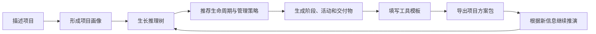

# 项目知识网页：产品定义草案 v0.2

> 工作名称：**项目经纬**（暂名）  
> 文档状态：MVP 核心决策已确认，等待教材资料盘点  
> 核心依据：《信息系统项目管理师教程（第 4 版）》，2023 年 3 月，清华大学出版社  
> 首要用户：刚入行、刚接手信息化项目的项目经理

---

## 1. 一句话定义

项目经纬是一个面向初级项目经理的**可解释项目推演与知识探索平台**：它把教材中的项目管理知识转化为关系图谱、工具模板和决策路径，并像一位有经验的前辈一样，根据真实项目情况逐层追问、推理，协助用户形成一套可以执行和导出的项目管理方案。

它不是“电子教材”，也不只是“AI 生成项目计划”。它的核心价值是把以下三件事连起来：

1. 教材概念是什么；
2. 为什么在当前项目中要这样判断；
3. 下一步具体做什么、使用什么工具、产出什么文档。

---

## 2. 产品定位

### 2.1 目标用户

首要用户画像：

- 0～3 年项目管理经验；
- 刚接手一个信息化项目，但缺少完整的工作框架；
- 学过或正在学习项目管理知识，却难以把术语转化为实际行动；
- 不确定应该先问什么、先做什么、形成哪些文档；
- 希望获得指导，但所在组织缺少成熟 PMO 或资深导师。

### 2.2 用户的核心任务

当用户“刚接到一个项目”时，他真正想完成的不是阅读一章教材，而是：

> 快速看懂项目、识别关键不确定性、选择合适的生命周期和管理方式，并形成第一版可沟通、可执行、可迭代的项目管理方案。

### 2.3 产品承诺

用户完成一次推演后，应该能够：

- 解释项目为什么适合某种生命周期与管理方法；
- 看清主要阶段、里程碑、活动、角色和交付物；
- 知道当前最应该补充哪些信息；
- 打开并填写关键项目管理模板；
- 从每项实践追溯到对应的教材知识；
- 导出一套可继续修改和用于沟通的项目方案。

### 2.4 非目标

第一阶段不把产品做成：

- Jira、禅道一类日常任务协作系统；
- 自动承诺项目成功的“万能计划生成器”；
- 对教材内容的逐页复制或替代教材；
- 覆盖所有行业、所有项目类型的企业级 PMO 平台；
- 以刷题、题库和背诵为中心的考试产品。

---

## 3. 核心产品观念

### 3.1 从“知识目录”转向“决策网络”

用户不是按照教材章节顺序开展项目。网站需要将教材重组为一个可计算、可追溯的知识网络：

```text
项目事实
  → 情境判断
  → 生命周期与管理策略
  → 阶段和里程碑
  → 管理活动
  → 工具与技术
  → 文档和交付物
  → 下一轮决策
```

### 3.2 从“直接给答案”转向“展示推理”

所有重要建议都应回答：

- 结论是什么；
- 根据了哪些用户输入；
- 对应什么项目管理知识；
- 为什么适合当前项目；
- 有哪些备选路径；
- 还缺少什么信息；
- 用户手动改变选择后，会影响哪些后续内容。

### 3.3 从“模拟器”转向“项目推演”

“模拟器”容易让人误以为系统可以准确预测工期、成本和结果。更准确的产品概念是：

> **导师式项目推演引擎**：以结构化规则和知识关系为骨架，以对话解释为界面，协助用户形成并检验项目管理思路。

### 3.4 教材与实践双视角

所有核心知识节点支持两种视角切换：

| 教材视角 | 实践视角 |
|---|---|
| 定义、所属章节、过程关系 | 什么时候用、为什么用 |
| 输入、工具与技术、输出 | 实际操作步骤与责任人 |
| 易混概念、理解要点 | 示例、模板、常见错误 |
| 知识体系中的位置 | 对当前项目的具体影响 |

两种视角不是两套互不相干的内容，中间必须有“从概念到行动”的桥接说明。

---

## 4. 核心体验闭环



### 4.1 第一步：描述项目

用户先回答一组低门槛问题，不要求掌握专业术语。输入维度初步包括：

- 项目目标与预期价值；
- 业务范围和主要功能；
- 发起方、用户和关键相关方；
- 预算、周期和硬性节点；
- 团队规模、能力与组织方式；
- 需求清晰度与变化频率；
- 技术成熟度与集成复杂度；
- 外部供应商和采购依赖；
- 数据、安全、合规和质量要求；
- 交付、运营与验收方式；
- 已知风险、假设和限制条件。

系统不必一次问完。先建立粗略画像，再根据推理分支逐层追问。

### 4.2 第二步：形成项目画像

将自然语言输入整理为结构化特征，例如：

- 需求不确定性：中高；
- 技术集成复杂度：高；
- 合规约束：高；
- 外部依赖：中高；
- 上线时间刚性：中；
- 用户反馈需求：高；
- 生命周期候选：混合型优先。

用户可以修正系统对项目的理解，避免错误输入一路传导。

### 4.3 第三步：生长推理树

推理树是产品的核心交互对象。每一条路径由以下节点组成：

```text
事实 → 解释 → 判断 → 建议 → 行动 → 工具/交付物
```

建议的节点类型：

- **事实节点**：来自用户输入或项目资料；
- **假设节点**：尚未验证但暂时用于推理；
- **判断节点**：系统对情境的解释；
- **决策节点**：生命周期、策略或方案选择；
- **活动节点**：下一步应该开展的工作；
- **工具节点**：建议使用的技术、图表或模板；
- **交付物节点**：活动形成的文档或成果；
- **风险节点**：可能影响后续路径的不确定性；
- **知识节点**：对应的教材概念与关系。

用户应能：

- 展开或收起分支；
- 查看每个结论的原因；
- 对建议选择“采用、调整、暂缓”；
- 手动覆盖系统建议并记录理由；
- 修改上游事实，观察受影响的分支重新计算；
- 将某个节点切换为教材视角或实践视角；
- 聚焦某条路径，避免一次看到整棵复杂树。

### 4.4 第四步：生成项目方案

推演结果不是一篇不可编辑的长文章，而是一套相互关联的结构化方案：

- 项目画像与管理复杂度摘要；
- 生命周期和管理方法建议；
- 阶段、里程碑和阶段门；
- 分阶段管理活动清单；
- 角色与职责建议；
- 工具和模板清单；
- 主要风险、假设和待确认事项；
- 关键交付物与验收思路；
- 教材知识映射；
- 需要用户确认的管理决策。

---

## 5. 典型示例项目

### 5.1 案例假设

贯穿第一版网站的示例项目暂定为：

> 某汽车企业建设一款面向车主的手机端车辆控制应用，提供车辆状态查看、车门与空调远程控制、充电管理、位置查询、账号与车辆绑定等能力。

它适合作为示例，因为同时包含：

- 移动端、云端、车端和第三方系统集成；
- 用户体验与快速迭代要求；
- 车辆控制安全、数据隐私与合规要求；
- 多团队、多供应商和多类相关方协作；
- 应用商店发布、车型适配和灰度上线；
- 软硬件接口、测试环境和真实车辆资源依赖。

### 5.2 初步管理判断（待案例参数确认）

该项目可能适合**混合型生命周期**：

- 项目目标、车辆安全边界、合规要求、关键接口和上线门槛需要前置规划；
- 移动端体验和部分业务功能适合迭代开发与用户验证；
- 车端控制、云端服务和 App 需要设置严格的集成测试与阶段门；
- 发布后仍需要运营监控、缺陷响应和版本迭代。

这个判断只作为案例起点。产品需要展示“为什么这样判断”，而不是把它写成固定答案。

---

## 6. 信息架构

### 6.1 一级导航

1. **开始一个项目**：创建项目并进入导师式问答；
2. **项目推演台**：查看推理树、生命周期和方案状态；
3. **知识图谱**：从生命周期、领域、过程和交付物探索知识；
4. **工具箱**：查看、填写和复用模板；
5. **案例库**：查看完整案例以及决策过程；
6. **我的项目**：保存的项目、方案版本与导出记录。

“教材 / 实践”是贯穿全站的视角切换，不作为两个孤立的频道。

### 6.2 知识对象

知识底座至少需要支持以下对象：

- 教材章节；
- 概念与原则；
- 生命周期与项目阶段；
- 管理领域与管理过程；
- 输入与输出；
- 工具与技术；
- 文档与交付物；
- 角色与相关方；
- 活动与决策点；
- 风险、问题、假设和约束；
- 项目特征与适用条件；
- 案例与情境。

### 6.3 关系类型

- 属于 / 包含；
- 前置于 / 后续于；
- 输入到 / 产生；
- 使用 / 被使用；
- 负责 / 参与 / 审批；
- 影响 / 被影响；
- 适用于 / 不适用于；
- 替代 / 互补；
- 证实 / 反驳；
- 教材映射 / 案例映射。

---

## 7. 核心页面

### 7.1 首页 / 新手入口

核心任务：让刚接到项目的用户立即知道从哪里开始。

主要内容：

- “我刚接到一个项目”主入口；
- 示例项目快捷体验；
- 生命周期总览入口；
- 继续上次推演；
- 今日待确认的关键项目问题。

### 7.2 项目访谈页

核心任务：以导师式对话收集项目事实，而不是让用户填写一张巨型表单。

主要内容：

- 对话区；
- 当前项目画像；
- 已确认事实、假设和缺失信息；
- “为什么问这个问题”的解释；
- 问题进度不是百分比，而是项目认知逐渐清晰的程度。

### 7.3 推理树画布

核心任务：让用户看见系统如何从项目事实推导到管理行动。

主要内容：

- 可缩放、平移的推理树；
- 分支聚焦与小地图；
- 节点解释侧栏；
- 采用、覆盖、暂缓决策；
- 变更影响高亮；
- 教材 / 实践视角切换；
- 未知信息形成的“待探索分支”。

### 7.4 生命周期驾驶舱

核心任务：从时间维度理解整个项目。

主要内容：

- 阶段时间线与阶段门；
- 阶段 × 管理领域矩阵；
- 关键里程碑；
- 各阶段活动、工具、角色和交付物；
- 风险与依赖叠加层；
- 预测型、敏捷型和混合型方案对比。

### 7.5 知识图谱

核心任务：自由探索知识关系。

主要内容：

- 多种入口：按阶段、领域、角色、工具、交付物；
- 局部关系图，默认不展示全量“毛线团”；
- 筛选、路径查找和上下游追踪；
- 从知识节点跳转到当前项目中的实际应用。

### 7.6 知识详情页

每个知识点采用统一结构：

1. 一句话解释；
2. 它解决什么问题；
3. 教材视角；
4. 实践视角；
5. 什么时候使用与不使用；
6. 输入、步骤、输出；
7. 工具示例；
8. 常见误区；
9. 与其他知识的关系；
10. 在示例项目中的应用。

### 7.7 工具与模板工作台

核心任务：从“看懂”进入“动手完成”。

首批候选模板：

- 项目章程；
- 相关方登记册；
- 项目范围说明书；
- WBS 与 WBS 词典；
- 里程碑计划与进度计划；
- RACI 矩阵；
- 沟通管理计划；
- 风险登记册与概率影响矩阵；
- 问题日志；
- 假设日志；
- 质量检查表；
- 变更请求与变更日志；
- 阶段门评审表；
- 验收清单；
- 项目管理计划大纲。

模板要求：

- 在线填写；
- 字段解释和填写示例；
- 自动带入项目已有信息；
- 与推理树节点双向关联；
- 支持保存版本；
- 支持导出和继续编辑；
- MVP 统一导出为 Word，后续再按工具类型补充 Excel、PDF 和图片导出。

### 7.8 方案总览与导出页

核心任务：形成一套能够与领导、团队和相关方沟通的成果。

主要内容：

- 方案完整度与待确认事项；
- 生命周期图；
- 管理策略摘要；
- 里程碑与活动计划；
- 风险和依赖摘要；
- 已完成模板；
- 推理依据与教材映射附录；
- 导出范围和格式选择。

---

## 8. MVP 边界

### 8.1 MVP 要验证的核心假设

> 初级项目经理愿意通过结构化追问完成一次项目推演，并且“可解释的推理树 + 可填写模板”比单纯阅读知识或接收一篇 AI 答案更能帮助他形成可靠的项目思路。

### 8.2 MVP 包含

1. 一个贯穿全站的汽车手机端控制应用案例；
2. 一套信息化项目基本情况访谈，约 12～20 个核心问题，并支持动态追问；
3. 一个可解释、可修改的推理树；
4. 预测型、迭代型、敏捷型和混合型生命周期的基础判断逻辑；
5. 一个阶段化生命周期视图；
6. “阶段 × 管理领域”矩阵；
7. 教材 / 实践双视角知识详情；
8. 约 40～60 个高价值知识节点，形成可完整浏览的局部图谱；
9. 约 12～15 个可填写核心模板；
10. 一套结构化项目方案的生成、编辑和 Word 导出；
11. 用户覆盖系统建议、记录理由，并看到下游影响；
12. 免登录的本地项目保存和基础方案版本能力。

知识覆盖策略建议采用：

> **全生命周期有广度，首批关键领域有深度。**

全生命周期中提示所有必要管理关注点；首批重点深入整合、范围、进度、质量、风险、相关方与变更管理，其他领域先提供关键节点和基础知识映射。

### 8.3 MVP 暂不包含

- 多人实时协作；
- 注册、登录、云端项目同步和跨设备使用；
- 企业组织架构、复杂权限和 PMO 后台；
- 与 Jira、禅道、飞书等外部系统集成；
- 真实项目执行数据的自动同步；
- 精确成本估算和资源自动排程；
- 完整考试题库；
- 用户自由创建任意知识图谱；
- 多行业深度案例；
- 复杂蒙特卡洛或离散事件模拟；
- 根据少量输入自动生成不可解释的“完整项目计划”；
- Excel、PDF、图片等多格式导出。

### 8.4 MVP 后的优先扩展

完成 MVP 核心领域后，按以下方向扩充知识深度、推演规则和工具模板：

1. 信息安全管理；
2. 成本管理；
3. 采购管理；
4. 配置管理；
5. 注册登录、云端保存和跨设备使用；
6. Excel、PDF、图片等多格式导出。

---

## 9. 视觉与交互方向

### 9.1 视觉关键词

- 精密；
- 清晰；
- 有结构；
- 数据可视化；
- 可探索；
- 克制的高级感；
- 轻微游戏化；
- 可信而不僵硬。

### 9.2 参考方向

已接入 `VoltAgent/awesome-design-md` 作为本地设计参考库。拟综合以下方向形成原创设计语言：

- **Linear**：精密、克制、清晰的信息层级；
- **Miro**：空间画布、探索感和对象操作；
- **IBM**：系统性、数据密度和专业可信度；
- **BMW 等汽车产品语言**：少量工业感与高级感，用于示例项目氛围，不主导整个产品。

不直接复制任何品牌的视觉身份、标识或完整组件系统。

### 9.3 可视化原则

每种图形必须回答一个明确问题：

| 用户问题 | 优先表达 |
|---|---|
| 项目从开始到结束经历什么 | 时间线、阶段门、泳道 |
| 为什么推荐这种管理方式 | 推理树、决策路径 |
| 阶段中要关注哪些管理领域 | 网格矩阵 |
| 工具或交付物从哪里来、流向哪里 | 输入输出网络、Sankey 图 |
| 谁负责什么 | RACI、泳道 |
| 风险集中在哪里 | 概率影响矩阵、热力图 |
| 哪些知识互相关联 | 局部知识图谱 |
| 不同生命周期如何比较 | 对比表、平行路径 |

默认展示局部关系，按需展开；避免一开始呈现不可读的巨型知识图谱。

### 9.4 轻游戏化方式

不以积分、勋章和连续签到为主，而使用与项目认知有关的反馈：

- 推理树随着回答逐渐生长；
- 未验证的信息显示为“未知区域”；
- 关键决策完成后解锁下游分支；
- 项目认知从模糊逐渐变清晰；
- 方案完整度反映关键依据是否齐全，而不是奖励用户机械点击；
- 修改上游条件时，下游节点以动态路径展示影响。

### 9.5 需要避免

- 为了“科技感”大面积使用霓虹和渐变；
- 暗色界面承载所有长文本；
- 每个页面都塞入不同图表；
- 用颜色作为唯一的信息区分方式；
- 过度动画干扰理解；
- 把知识图谱做成无法阅读的节点毛线团；
- 视觉酷炫但无法说明下一步行动。

---

## 10. 内容与可信度策略

### 10.1 内容生产原则

- 教材作为知识结构和事实依据；
- 网站使用原创解释、原创案例和原创图示；
- 避免大段复制教材原文；
- 教材结论与实践建议明确区分；
- 对重要建议展示来源、适用条件和不确定性；
- 不把模型生成内容直接视为已审核知识。

### 10.2 内容工作流

1. 建立教材章节和概念目录；
2. 将概念拆为结构化知识对象；
3. 建立对象之间的关系；
4. 编写教材视角说明；
5. 编写实践视角、案例和反例；
6. 关联工具模板；
7. 由熟悉项目管理的人进行内容校核；
8. 发布时保留版本和审核状态。

### 10.3 建议的可信度标识

- 教材明确内容；
- 行业通用实践；
- 当前项目推断；
- 用户提供事实；
- 尚待验证假设。

---

## 11. 产品成功标准

MVP 可用以下指标验证：

- 新用户能在 15 分钟内形成第一版项目画像和生命周期建议；
- 用户能复述系统推荐背后的主要原因，而不仅是接受结论；
- 用户能在一次体验中完成至少一个关键模板；
- 用户能发现此前没有意识到的相关方、风险或管理活动；
- 用户愿意把导出方案用于真实项目讨论；
- 修改项目条件后，用户能理解管理方案为何发生变化；
- 教材知识能够通过当前项目情境被快速找到和理解。

---

## 12. 初步技术思想（非最终技术选型）

为了保证推演可解释，建议采用三层组合，而不是完全依赖大模型：

1. **结构化知识层**：教材知识对象、关系、模板和案例；
2. **规则与推演层**：将项目特征映射到生命周期、风险和管理活动；
3. **语言交互层**：负责追问、解释、归纳和生成易读表达。

大模型可以帮助用户表达和理解，但关键决策路径必须能回到结构化事实、规则和知识节点。

---

## 13. 已确认的 MVP 产品决策

1. 最终成果采用“项目管理方案主文档 + 多份可独立使用的模板附件”的方案包结构；
2. 主要交互采用“导师对话 + 结构化表单 + 可视化推理树”的混合方式；
3. MVP 免登录，优先走通产品闭环，使用本地保存；注册、登录与云端能力后续一次性补全；
4. MVP 只实现 Word 导出；
5. 教材资料由用户现有的 Obsidian 知识库和 Excel 工作簿提供；
6. MVP 采用“全生命周期有广度，整合、范围、进度、质量、风险、相关方、变更管理有深度”的范围；
7. 安全、成本、采购、配置管理进入 MVP 后优先扩展清单；
8. 示例案例采用中等规模、混合型管理的汽车手机端控制应用，具体项目参数在推演脚本阶段冻结。

### 13.1 当前待完成事项

- 接收并清点 Obsidian 与 Excel 教材资料；
- 建立“教材章节—知识对象—实践解释—工具模板”的映射样本；
- 确认示例项目的组织背景、周期、团队与供应商设定；
- 根据样本验证知识模型是否足以支撑推理树。

---

## 14. 后续工作顺序

1. 确认本产品定义和 MVP 决策；
2. 建立示例项目设定与完整推演脚本；
3. 建立首批知识对象和关系模型；
4. 绘制站点地图与核心用户流程；
5. 制作低保真页面原型；
6. 确立原创视觉系统与可视化语法；
7. 制作高保真交互原型；
8. 再进入技术架构与 MVP 实现。
